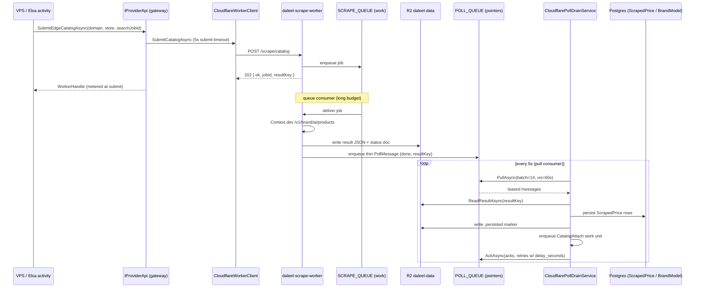
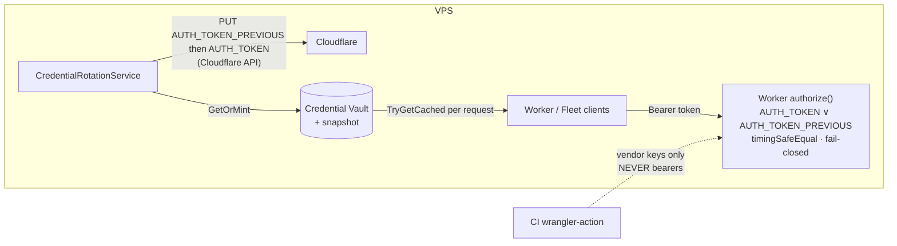

# The Cloudflare Edge Execution Layer

> How Daleel relocates heavy, slow, or bursty work off the VPS onto Cloudflare Workers: the
> scrape-worker + poll-drain architecture that makes crawls durable-by-construction, the Workers-AI
> fleet (classify / extract / filter), the VPS-minted bearer-token authority, and the wrangler deploy
> model for QA vs prod. Every claim is grounded in the source — file paths and class/method names are
> cited. When the code and this doc disagree, the code wins; fix the doc.

---

## 0. The shape in one paragraph

The workers are an **execution layer**, not a vendor swap. A store-catalogue crawl that used to run
inline (bounded by the VPS's in-process concurrency and killed by any search-side timeout) is now
**submitted** to the `daleel-scrape-worker`, which returns `202` immediately, does the vendor call on a
long-budget queue consumer, writes the result to R2 the moment it exists, and enqueues a thin pointer
onto a poll queue. A VPS background service — the `CloudflarePollDrainService`, NOT the search workflow
— pulls that pointer and persists the result. The decoupling is the whole point: a crawl finishing after
the search's 10-minute deadline, after a cost-cap trip, or even after an app restart still lands in the
price time series. Results are never lost to a timeout again. Alongside the scrape-worker sits a
**fleet** of Workers-AI hosts (classify / extract / filter) reached through the same metered gateway,
and the `daleel-search-worker` (a SerpAPI/Places caching proxy). Every worker authenticates the VPS
with a bearer the VPS itself mints and rotates — never a CI secret.

There are six worker scripts: `scrape-worker`, `search-worker`, `classify-worker`, `extract-worker`,
`filter-worker` (under `workers/*`), plus the standalone read-only `log-viewer`.

---

## 1. Why an execution layer

The win is the execution SHAPE, not the backend (`workers/scrape-worker/src/index.js` header): async,
queue-backed, horizontally parallel, and durable-by-construction. The scrape-worker's own vendor call
is still Context.dev's `/v1/brand/ai/products` — identical to the inline path — but:

- **Async + queue-backed.** A submit returns `202` and enqueues onto `SCRAPE_QUEUE`, which the same
  worker push-consumes. Queue handlers get a far longer execution budget than `waitUntil`'s ~30s grace.
- **Durable the moment results exist.** The consumer writes result JSON to R2, writes a status doc, and
  enqueues a `PollMessage` onto `POLL_QUEUE`. A VPS-side timeout can no longer discard a finished crawl.
- **Rollback is a toggle, not a redeploy.** Whether the pipeline actually routes work to the workers is
  the admin-editable `cloudflare.execution.enabled` SystemConfig flag (strangler-fig). Endpoints/secrets
  live in the environment; the flag decides usage.

---

## 2. The scrape-worker + poll-drain architecture

### 2.1 The two-queue flow



Results travel **by reference**: the worker writes R2 and the drain reads R2 — nothing round-trips
through worker HTTP responses (`CloudflareWorkerClient` class summary).

### 2.2 Submission — `CloudflareWorkerClient`

`src/Daleel.Web/Cloudflare/CloudflareWorkerClient.cs`. The VPS side of the edge.

- `SubmitCatalogAsync(domain, store, searchJobId, maxProducts)` → POST `/scrape/catalog`. A submit runs
  from inside a store sub-workflow whose whole budget is ~30s, so it uses a hard **5s `SubmitTimeout`**:
  a hanging worker must fail FAST into the inline fallback, not eat the child's budget and fault it. On
  rejection or timeout it returns **null**, and the caller degrades to the inline crawl.
- `SubmitBrandAsync(domain, brandName, searchJobId, refresh)` → POST `/scrape/brand` with
  `withCatalog: true`. Brand harvests have an **eternal `resultKey`** (their `searchJobId` is null), so
  without `refresh: true` the worker's idempotency short-circuit would freeze the catalogue after the
  first crawl — the VPS only re-submits after its own TTL and always wants a fresh crawl.
- `ScrapePageAsync(url, format)` → POST `/scrape/page`, the synchronous single-page edge scrape (25s
  budget). Null on rejection → the caller's inline provider takes over. This is tier 1 of the
  `ProviderApi.ScrapePageAsync` chain (see Providers doc).
- `GetJobStatusAsync(jobId)` → GET `/jobs/{id}`.
- `ReadResultAsync<T>(resultKey)` reads + deserializes the finished doc from R2 (Data bucket), refusing
  a **truncated** read past `MaxResultBytes` (8 MiB) — a clipped JSON doc would deserialize to garbage,
  so it returns null and lets the caller keep polling rather than persist a silently partial result.

`maxProducts ≤ 0` is sent as `null` (absent) — "vendor ceiling", per the no-result-caps invariant.

### 2.3 The `WorkerHandle` contract

`src/Daleel.Web/Cloudflare/WorkerContracts.cs`. A submit returns a `WorkerHandle`:

```
WorkerHandle { JobId, ResultKey }
```

`JobId` is where the job runs; `ResultKey` is the R2 object key (in the Data bucket) the result will be
written to when done. The worker's `202` envelope is `WorkerSubmitResponse { ok, mode, jobId,
resultKey, error }`; a valid handle requires `ok: true` with non-empty `jobId` and `resultKey`.

`jobId` is deterministic: the caller's `Idempotency-Key` or a SHA-256 of the body. The result key is
deterministic per jobId, and a re-submit whose result already exists short-circuits to "done" without
re-running — **at-least-once safe** — unless `refresh: true` / `maxAgeSeconds` forces a re-run of a
stale result. A short-lived `.inflight` R2 marker additionally stops a queued/running jobId being
enqueued twice.

### 2.4 The poll drain — `CloudflarePollDrainService`

`src/Daleel.Web/Cloudflare/CloudflarePollDrainService.cs`. A `BackgroundService` that ticks every 5s,
pulling batches of 10 from the poll queue (`IQueuePullClient`, `src/Daleel.Web/Cloudflare/QueuePullClient.cs`
— a Cloudflare Queues **pull HTTP consumer**; pull, not push, because the thing reacting is Elsa on the
VPS, which a Worker push-consumer could never be).

Load-bearing invariants:

- **Runs whenever the queue credentials are configured** — deliberately NOT gated on the
  `cloudflare.execution.enabled` flag. Flipping the flag off must never strand in-flight results.
- **At-least-once → idempotent, with TWO distinct markers.** A `.persisted` marker on genuine SUCCESS
  (the success path gates on this and NOTHING else) and a separate `.failed` marker on
  terminal-failure/abandon paths. They must stay distinct: jobIds are eternal SHAs, so a failed
  delivery writing the SUCCESS key would blackhole every later successful crawl of the same key — it
  would ack without persisting.
- **Faulted ≠ empty.** A terminal worker failure surfaces a real error on the `/admin/timeline` system
  event feed (`store.prices.edge_failed`), then acks — never a silent empty.
- **Explicit backoff.** A retry re-queues the lease with `delay_seconds = min(60, 15 × attempts)` — the
  drain never relies on the visibility timeout alone.
- **Marker BEFORE ack.** Persist rows → write marker → ack; if the ack fails, the redelivered message
  short-circuits on the marker instead of duplicating.

Handlers by `PollMessage.Kind`:

- `catalog` → `PersistCatalogAsync`: writes `ScrapedPrice` rows (the same rows the inline
  `ScrapePricesActivity` writes, so store pages read worker results with zero changes), then **enqueues
  a `CatalogAttach` enrichment work unit** so the landed crawl becomes grid items — catalog units are
  timer-free (submit-and-finish), so this enqueue IS the event that turns a persisted crawl into
  products. Then meters the drain (`cloudflare/drain`) and publishes `store.prices.drained`.
- `brand` → `PersistBrandAsync`: upserts `BrandModel` rows (the same shape `BrandCatalogService.HarvestAsync`
  writes). The brand row must already exist — an unknown brand is surfaced as a failure event, never
  guessed (site-discovery no-guessing rule).

The worker's **final delivery** (`MAX_DELIVERIES = 4`, kept in sync with wrangler's `max_retries: 3`)
finishes the job as a terminal error rather than retrying — so the VPS always learns the outcome, never
a status stuck "running".

### 2.5 The drain-ready gate

`ProviderApi.EdgeDrainReady` (Providers doc §2.1) is what a submit checks before handing work off: edge
client present **and** `CloudflareWorkerOptions.CanDrainQueue` (account id + `CF_QUEUES_API_TOKEN` +
`CF_POLL_QUEUE_ID`) **and** R2 configured. A submit REPLACES inline persistence, so without a working
drain the result would be stranded — the gate keeps the inline path authoritative until the full return
path exists. `Program.cs` (~line 416) enforces the same at startup: `CF_SCRAPE_WORKER_URL` set but R2
absent DISABLES the execution layer loudly rather than silently stranding every crawl.

---

## 3. Edge catalogue / brand submission from the gateway

`SubmitEdgeCatalogAsync` / `SubmitEdgeBrandAsync` on `IProviderApi`
(`src/Daleel.Web/Services/ProviderApi.cs`) are the pipeline-facing entry points. They:

1. Return null when `_edge` is unconfigured (caller uses the inline crawl).
2. Call the worker client's submit, and **record the cost only on an accepted handle** — a
   failed/rejected submit costs nothing and falls back to the inline path, whose own metering records
   the crawl (recording here too would double-charge). The estimate uses the
   `scrape-worker/context.dev` provider name (`catalog/extract` or `brand/ai/products`) so the vendor
   rate applies plus the `edge_request` hop, and edge and inline crawls hit the cost cap identically.
3. The **drain** separately meters only its own queue+R2 overhead as `cloudflare/drain` — the submit
   owns the crawl's whole vendor accounting.

---

## 4. The Workers-AI fleet — classify / extract / filter

`src/Daleel.Web/Cloudflare/CloudflareFleetClient.cs`, options in `CloudflareFleetOptions.cs`. A
separate, capability-shaped fleet reached ONLY through `IProviderApi` (so every call is metered).
Each host is independently optional — a null endpoint means that capability stays on its inline path.

| Capability | `IProviderApi` probe | `IProviderApi` method | Worker | Batch cap |
|------------|----------------------|-----------------------|--------|-----------|
| classify | `HasEdgeClassify` | `ClassifyTextAsync` | `classify-worker` | 100 text items/call |
| extract | `HasEdgeExtract` | `ExtractProductsFromContentAsync` | `extract-worker` | single-doc |
| filter (text) | `HasEdgeFilter` | `FilterTextFindingsAsync` | `filter-worker` | 50 text items/call |
| filter (images) | `HasEdgeFilter` | `FilterImageFindingsAsync` | `filter-worker` | 20 urls/call |

All fleet calls are **best-effort signals**: a null/empty return means "no verdict", and callers keep
their current inline behavior (`workers-ai/*` metering, best-effort). The client enforces the
per-worker batch caps in `PostChunkedAsync` — every host hard-400s an oversized batch (QA job #48 lost a
59-item halal batch that way), so callers batch freely and never learn per-worker limits; the constants
here mirror `MAX_TEXT_ITEMS` / `MAX_IMAGE_URLS` in each worker's `index.js` and must move together.

The **filter** host is deliberately capability-shaped, not vendor-shaped: it returns FINDINGS the VPS
`HalalModerator` may weigh — policy (whitelist, thresholds, riba-never-filtered, veto, audit) never
leaves the VPS, and these signals must be A/B-validated against the current classifier before any
default routing flips.

The `extract-worker` is the edge equivalent of the store extractor: raw HTML/markdown → Daleel product
JSON via Workers-AI in JSON mode. v1 is synchronous single-document (a page extract is seconds); the
async batch flow (202 + queue + R2 + poll) is a later phase behind the same routes.

---

## 5. The token authority — VPS-minted bearers

Worker bearers are **never CI secrets**. The VPS mints, holds, pushes, and rotates them via the
Cloudflare API. This is the single most important operational fact about the fleet.

### 5.1 The lifecycle — `CredentialRotationService`

`src/Daleel.Web/Cloudflare/CredentialRotationService.cs`. A `BackgroundService` that on startup loads
the credential-vault snapshot, then **ensures → pushes** every worker bearer for this environment, and
optionally rotates on a schedule.

- **`EnsureAndPushAllAsync`** — for each worker script, `GetOrMint` its bearer in the vault (minting
  when missing) and PUT it as the worker's `AUTH_TOKEN` secret via the Cloudflare API. Retries on a
  fast 2-minute interval until every script has accepted its bearer (covers first-deploy races), then
  settles into a 6-hour heartbeat that also re-pushes after worker re-deploys.
- **`RotateWorkerAsync`** — **`AUTH_TOKEN_PREVIOUS`-first ordering.** The OLD token is pushed as
  `AUTH_TOKEN_PREVIOUS` FIRST, then the new value as `AUTH_TOKEN`. At no moment does the worker reject
  either the old value (still held by in-flight callers and the app's snapshot readers) or the new one.
  If the new-token push fails after the vault snapshot already advanced, a `_rotationRepushPending` flag
  arms a fast re-push on the next loop — never leaving a 401 window to the 6h heartbeat.
- A worker that hasn't received its bearer yet **fails CLOSED** — its `authorize()` 500s — so a missed
  push is loud, never open.

### 5.2 The worker side — `authorize()`

`workers/scrape-worker/src/index.js` `authorize()`:

- No `AUTH_TOKEN` secret → **fail closed** (`500 server_misconfigured`); a missing secret must never
  mean "open to the world".
- Accepts a `Bearer` (or `Basic`) token, compared with `timingSafeEqual`.
- **Rotation grace:** the presented token matches `AUTH_TOKEN` OR `AUTH_TOKEN_PREVIOUS` — so in-flight
  callers and the app's cached clients never 401 mid-rotation. `AUTH_TOKEN_PREVIOUS` unset is the normal
  steady state.

### 5.3 Environment scoping & the `CF_*_WORKER_TOKEN` aliases

`WorkerNames` (`CredentialRotationService.cs`) scopes everything by `DALEEL_ENV`: prod scripts are bare
(`daleel-scrape-worker`), QA scripts carry a `-qa` suffix (`daleel-scrape-worker-qa`). The five
token-authority-managed bases are scrape / search / classify / extract / filter (the read-only
log-viewer is NOT authority-managed — it uses a standalone read bearer uploaded from a CI secret).

`WorkerNames.BearerAlias` maps a legacy `CF_{X}_WORKER_TOKEN` env-var name to this environment's vault
bearer name `worker:daleel-{x}-worker[-qa]`, so every resolver that historically read those env vars
picks up authority-minted bearers first. The clients wire this as a per-request bearer provider
(`Program.cs`: `bearer: () => vaultBearer(sp, "daleel-scrape-worker")` and
`bearer: capability => vaultBearer(sp, $"daleel-{capability}-worker")`), which reads the vault snapshot
(`ICredentialVault.TryGetCached`). Because the bearer is resolved **per request**, a rotated token
applies to long-lived HTTP clients **without a restart**; the env-configured `..._TOKEN` is only a
static fallback (normally empty on deployments that manage tokens dynamically).



---

## 6. Wrangler deploy: QA vs prod

Each worker has a `workers/<name>/wrangler.jsonc`. Config uses the **base + `env.qa` override** pattern:
prod is the top-level config; `wrangler deploy --env qa` applies the `env.qa` block. QA is isolated two
ways — a separate bucket/queues binding AND an `ENV_PREFIX` on every R2 key (belt-and-suspenders so even
a mis-provisioned shared bucket can't cross-bleed).

Example (`workers/scrape-worker/wrangler.jsonc`):

| Resource | prod | QA (`env.qa`) |
|----------|------|---------------|
| script name | `daleel-scrape-worker` | `daleel-scrape-worker-qa` |
| R2 bucket | `daleel-data` | `daleel-qa-data` |
| work queue | `daleel-scrape-work` | `daleel-qa-scrape-work` |
| poll queue | `daleel-poll-work` | `daleel-qa-poll-work` |
| DLQ | `daleel-scrape-dlq` | `daleel-qa-scrape-dlq` |
| `ENV_PREFIX` var | `prod` | `qa` |

Note that Cloudflare **bindings do not inherit across environments** — the `env.qa` block re-declares
buckets/queues/AI bindings; only `observability`/`limits` inherit (see `extract-worker`'s comment).

### 6.1 The two deploy pipelines

- **`.github/workflows/deploy-workers.yml` (prod)** — `push` to `main` under `paths: workers/**`.
  Ships all six workers via a matrix. `command: deploy` (no environment).
- **`.github/workflows/deploy-workers-qa.yml` (qa)** — a PR carrying the **`qa` label**
  (`types: [labeled, synchronize, reopened]`, paths-scoped to `workers/**`); new pushes while labelled
  re-deploy. Fork PRs are refused (they don't get secrets).

The load-bearing QA detail: the deploy step uses **`environment: qa`**, NOT
`command: deploy --env qa`. The `cloudflare/wrangler-action` honours `environment` when uploading
secrets, so without it the vendor keys would be uploaded to the PROD worker instead of the `-qa` one.

### 6.2 What CI uploads — and what it doesn't

CI uploads only **vendor keys** as worker secrets, per-worker via the matrix `worker_secrets`:

- `scrape-worker` → `CONTEXT_DEV_API_KEY`
- `search-worker` → `SERPAPI_KEY`, `GOOGLE_PLACES_API_KEY`
- `classify` / `extract` / `filter` → none
- `log-viewer` → `AUTH_TOKEN` (its standalone read bearer, the one exception)

**Worker bearers (`AUTH_TOKEN` / `AUTH_TOKEN_PREVIOUS`) are NOT uploaded by CI** — the VPS token
authority pushes them via the Cloudflare API (`/admin/credentials`). Required GitHub secrets are
`CLOUDFLARE_API_TOKEN` (Workers Scripts: Edit + R2 + Queues + KV + Workers AI + **Durable Objects: Edit**
— the search-worker's SerpAPI hourly cap is a DO whose migration `wrangler deploy` applies, so a token
without Durable Objects: Edit 403s that deploy) and `CLOUDFLARE_ACCOUNT_ID`. Queues, DLQs, the poll
pull-consumer, and KV namespaces are **check-or-created** idempotently per run by `workers/provision.sh`.

---

## 7. Configuration surface

| Env var | Read by | Purpose |
|---------|---------|---------|
| `CF_SCRAPE_WORKER_URL` | `CloudflareWorkerOptions.FromConfiguration` | scrape-worker base URL (minimum to submit) |
| `CF_SCRAPE_WORKER_TOKEN` | same | optional static bearer fallback |
| `CLOUDFLARE_ACCOUNT_ID` | worker options + CF Browser + secrets client | account id (shared with R2) |
| `CF_QUEUES_API_TOKEN` | worker options → `CanDrainQueue` | queues_read + queues_write for the pull consumer |
| `CF_POLL_QUEUE_ID` | same | poll queue ID (not name) |
| `CF_{SEARCH\|CLASSIFY\|EXTRACT\|FILTER}_WORKER_URL` | `CloudflareFleetOptions` | fleet host URLs |
| `CF_{X}_WORKER_TOKEN` | `WorkerNames.BearerAlias` | legacy alias → vault bearer `worker:daleel-{x}-worker[-qa]` |
| `DALEEL_ENV` | `WorkerNames.Suffix` | `qa` → `-qa` script suffix; else prod |
| `cloudflare.execution.enabled` | SystemConfig (admin) | routes work to workers (rollback toggle) — NOT the drain gate |
| `credentials.rotation_days` | SystemConfig (admin) | scheduled rotation; 0 = manual-only (default) |

---

## 8. Key files

| File | Role |
|------|------|
| `src/Daleel.Web/Cloudflare/CloudflareWorkerClient.cs` | VPS→scrape-worker: submit catalog/brand, sync page scrape, R2 result reads; 5s submit timeout, per-request bearer |
| `src/Daleel.Web/Cloudflare/CloudflarePollDrainService.cs` | Pull-drains the poll queue; `.persisted`/`.failed` markers, faulted≠empty, CatalogAttach enqueue, drain metering |
| `src/Daleel.Web/Cloudflare/QueuePullClient.cs` | Cloudflare Queues pull HTTP consumer (lease/ack with `delay_seconds`) |
| `src/Daleel.Web/Cloudflare/WorkerContracts.cs` | `WorkerHandle`, `WorkerSubmitResponse`, `WorkerJobStatus`, `PollMessage`, `CatalogResultDoc` |
| `src/Daleel.Web/Cloudflare/CloudflareWorkerOptions.cs` | scrape-worker + queue config; `CanDrainQueue`; `EnabledFlag` |
| `src/Daleel.Web/Cloudflare/CloudflareFleetClient.cs` | classify/extract/filter hosts; per-worker batch caps; best-effort signals |
| `src/Daleel.Web/Cloudflare/CloudflareFleetOptions.cs` | fleet endpoint config (URL mandatory, token optional) |
| `src/Daleel.Web/Cloudflare/CredentialRotationService.cs` | token authority: ensure→push, `AUTH_TOKEN_PREVIOUS`-first rotation, `WorkerNames`/`BearerAlias` |
| `src/Daleel.Web/Cloudflare/CloudflareSecretsClient.cs` | pushes worker secrets via the Cloudflare API |
| `src/Daleel.Web/Services/ProviderApi.cs` | `SubmitEdgeCatalogAsync`/`SubmitEdgeBrandAsync`, `EdgeDrainReady`, submit-time metering |
| `workers/scrape-worker/{wrangler.jsonc,src/index.js}` | scrape execution host; two-queue flow; `authorize()` fail-closed + rotation grace |
| `workers/{search,classify,extract,filter,log-viewer}-worker/*` | the rest of the fleet |
| `.github/workflows/deploy-workers.yml` / `deploy-workers-qa.yml` | prod (push→main) / QA (`qa` label, `environment: qa`) deploys |
| `workers/provision.sh` | idempotent check-or-create of queues/DLQs/KV per environment |

See also the **Providers & Scraping** doc for the fallback chain the scrape-worker's page scrape plugs
into as tier 1.
