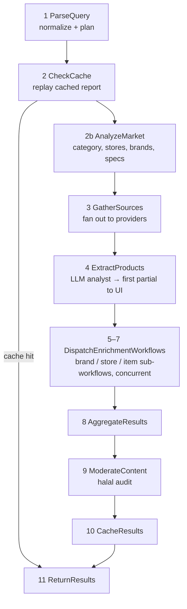

# Elsa Workflows

> The search pipeline is an **in-process Elsa 3 workflow** of `CodeActivity` steps, plus six
> specialised sub-workflows fanned out per entity. Sources: `src/Daleel.Web/Pipeline/SearchWorkflow.cs`
> and `src/Daleel.Web/Pipeline/SubWorkflows/`.

## The main SearchWorkflow

A flat `Sequence` of eleven activities; each reads/writes the scoped `SearchPipelineState`, and every
post-cache step no-ops when `CheckCache` served a stored report.

**Deliberate design tradeoff** (from the source, don't "fix" without intent): control flow lives in
plain C# — cache hits self-skip via `state.FromCache` guards, and the fan-out is `Task.WhenAll` inside
the dispatch activity — not Elsa `If`/`ForEach` edges. Elsa earns its keep as the activity
registration, sequencing and per-step telemetry seam, **not** as a declarative control-flow engine.
Every activity derives from `CancellableActivity`, which does a best-effort (never fatal)
`CancelRequested` read per step.

## The six sub-workflows

Dispatched by `SubWorkflowDispatcher` in bounded parallel, each in its own DI scope, operating on a
scoped state object the dispatcher seeds and reads back (per-run state stays in DI, never Elsa Input).

| Workflow | Per | What it does |
|---|---|---|
| `BrandResearchWorkflow` | brand | Resolves the brand's local site, scrapes catalogue + reputation via Context.dev, persists profile, locates images. |
| `StoreResearchWorkflow` | store | Scrapes the store site, verifies on Google Maps, extracts contacts, persists the profile, harvests catalogue prices. |
| `ItemDeepDiveWorkflow` | product | Scrapes the detail page, **identifies** the canonical brand model, runs the smart-spec pipeline (raw → merge/clean → canonical sheet), compares prices, collects reviews. |
| `StoreCrawlWorkflow` | store URL | LLM crawler for e-commerce stores: assess platform → site search / category / Shopify `/products.json` → walk paginated listings (price/stock/SKU) → deep-dive top matches. |
| `BrandCrawlWorkflow` | brand site | LLM crawler for manufacturer sites: find the **catalogue section** (not the homepage), walk product lines extracting specs/images (brand sites rarely price), deep-dive top models. |
| `ProductDetailWorkflow` | product URL | Full-record extractor for one detail page: every image, complete specs, price, reviews, seller → R2 `EntityDocument` + Postgres index + price observation. |

The three **crawlers** (store / brand / product-detail) share `AgentService.Crawl.cs` prompts but are
deliberately specialised: store crawls replace price data, brand crawls fill additively.

## Execution & persistence

- **Runner:** `WorkflowSearchRunner` runs the workflow via `IWorkflowRunner` (kept intentionally —
  do not switch to `IWorkflowRuntime`). Queued `SearchJob` rows in Postgres *are* the queue.
- **Instance persistence:** optional and Postgres-only — Elsa's management feature stores workflow
  instances in the `Elsa` schema of the events database (see [Data & Storage](/data-storage) §3).
- **Timeline:** every step emits `PipelineEvent`s; `/admin/workflows` rebuilds a per-run step
  timeline from the job queue + event store (see [Observability & Admin](/observability-admin)).
- **After "Ready":** the durable [Enrichment Work Queue](/enrichment-queue) (`EnrichmentWorkItems`)
  continues filling prices/images/stock — that part is queue-driven, not Elsa.
