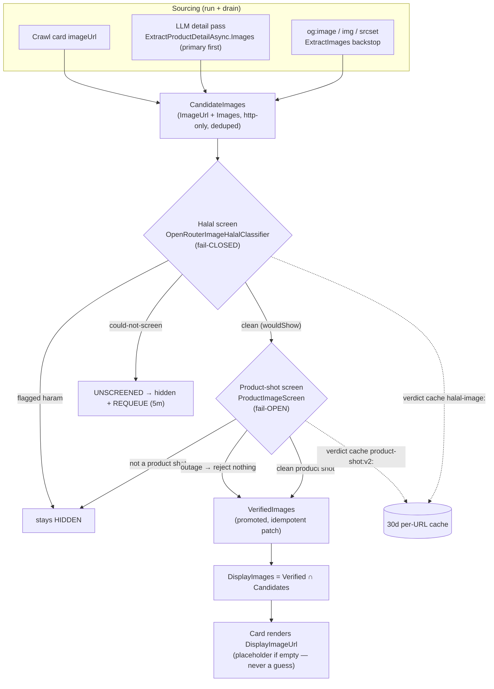

# Product-Image Pipeline

> Where a product photo comes from, how it is gated before it can ever render, and the two vision
> screens that decide what a card shows. The governing rule: **a wrong image misleads; a missing one
> merely disappoints** — so images are hidden by default and only *promoted* to display after they
> clear screening. Everything here is drawn from the source with **file:line** references — when the
> code and this doc disagree, the code wins; fix the doc. (Line numbers reflect the worktree at the
> time of writing; if a file shifts, search the method name.)

---

## 0. The shape in one paragraph

Images are **sourced** during the run and the enrichment drain from three places: the crawl's
per-card `imageUrl`, the LLM detail pass (`ExtractProductDetailAsync.Images`, primary first), and —
as a backstop — an `og:image` / HTML-`` / `srcset` regex scrape of the raw page. There is **no
Google image search** (deleted). All of these land as *raw candidates* on the product model
(`ImageUrl` + `Images` → `CandidateImages`). Nothing raw ever renders. The `ImageCheckHandler`
enrichment unit runs **two vision screens** over the candidates — a **halal image screen**
(fail-CLOSED) and a **clean-product-shot screen** (fail-OPEN) — and promotes only the images that
clear **both** into `VerifiedImages`. The UI renders `DisplayImages` / `DisplayImageUrl`, which are
the intersection of candidates and verified. A per-URL verdict cache means repeated searches don't
re-pay to screen the same photo.

---

## 1. Sourcing — where a candidate photo comes from

### 1a. Crawl extraction (`imageUrl` per card)

Every card the store/brand crawlers extract carries an `imageUrl`. The crawl DTO's `imageUrl` field
([`AgentService.Crawl.cs:577`](../../src/Daleel.Agent/AgentService.Crawl.cs)) is absolutised against
the page origin and mapped onto `ProductListing.ImageUrl`
([`AgentService.Crawl.cs:310`](../../src/Daleel.Agent/AgentService.Crawl.cs)). The extraction prompts
explicitly ask for *"a photo that shows the product — NOT a logo, promo banner, or text/graphic
image"* ([`AgentService.Crawl.cs:666,727`](../../src/Daleel.Agent/AgentService.Crawl.cs)) — a
first-pass filter, but never trusted on its own (the vision screens re-judge everything).

### 1b. The LLM detail pass (`ExtractProductDetailAsync.Images`, primary first)

The richest source. `ExtractProductDetailAsync`
([`AgentService.Crawl.cs:166-193`](../../src/Daleel.Agent/AgentService.Crawl.cs)) mines a product
detail page for its complete record, whose `images` array is **primary first** and mapped into
`ProductDetail.Images` (absolutised, deduped, junk dropped)
([`AgentService.Crawl.cs:386-388`](../../src/Daleel.Agent/AgentService.Crawl.cs)). The detail prompt
asks for *"URLs of photos that SHOW THE PRODUCT … primary first; EXCLUDE only images that don't show
the product: logos, promotional banners/ads, and pure text/graphic images"*
([`AgentService.Crawl.cs:757`](../../src/Daleel.Agent/AgentService.Crawl.cs)).

This is exactly what `ItemEnrichmentService.FindImageForItemAsync`
([`ItemEnrichmentService.cs:635-685`](../../src/Daleel.Web/Pipeline/ItemEnrichmentService.cs)) uses to
fill a still-imageless item. It:

1. Picks the page to scrape — the item's first offer URL (the store's product page), else the brand
   site — via `ImageSourceUrl`
   ([`ItemEnrichmentService.cs:700-702`](../../src/Daleel.Web/Pipeline/ItemEnrichmentService.cs)),
   i.e. only pages the crawl already trusts.
2. Renders the page and calls `ExtractProductDetailAsync`, taking `detail.Images`
   ([`:654-656`](../../src/Daleel.Web/Pipeline/ItemEnrichmentService.cs)).
3. Screens the LLM's picks with `OfferVerificationHandler.IsProductImageCandidate` to drop
   chrome/social/OG-generic images (a marketplace's `og:image` is often a Facebook share card, not
   the product) ([`:661`](../../src/Daleel.Web/Pipeline/ItemEnrichmentService.cs)). If none survive,
   it falls through to the HTML backstop.

The returned gallery is split primary-first into `ImageUrl` + `Images`
(`SplitGallery` [`:689-696`](../../src/Daleel.Web/Pipeline/ItemEnrichmentService.cs);
applied at [`:321-322`](../../src/Daleel.Web/Pipeline/ItemEnrichmentService.cs)).

### 1c. The `og:image` / HTML / `srcset` regex backstop

When the LLM finds nothing — the photo lived only in the HTML `<head>` as `og:image`, or in a
lazy-load attribute the markdown render drops — `FindImageForItemAsync` re-fetches the **raw HTML**
and calls `OfferVerificationHandler.ExtractImages`
([`ItemEnrichmentService.cs:671-673`](../../src/Daleel.Web/Pipeline/ItemEnrichmentService.cs);
[`EnrichmentHandlers.cs:1094-1114`](../../src/Daleel.Web/Pipeline/Enrichment/EnrichmentHandlers.cs)).
The backstop lives in `OfferVerificationHandler`
([`EnrichmentHandlers.cs`](../../src/Daleel.Web/Pipeline/Enrichment/EnrichmentHandlers.cs)):

| Method | What it does | Reference |
|--------|--------------|-----------|
| `ExtractOgImage` | The page's declared canonical photo — `og:image` / `twitter:image` meta. Trusted *without* the product-path gate (the page declares it as its product image); only the chrome/promo blocklist applies. Needs raw HTML (markdown drops `<head>`). | [`:1072-1083`](../../src/Daleel.Web/Pipeline/Enrichment/EnrichmentHandlers.cs) |
| `ExtractImages` | Every qualifying image in document order — `og:image` leads (canonical), then in-body images. Format-agnostic: markdown ``, HTML ``, and lazy-load `data-src` / `data-original` / `data-lazy` / `srcset`. | [`:1094-1114`](../../src/Daleel.Web/Pipeline/Enrichment/EnrichmentHandlers.cs) |
| `IsProductImageCandidate` | Chrome/social/OG-generic reject for an already-chosen URL (no product-path gate) — screens LLM-picked gallery images so a marketplace's generic `og:image` (e.g. `opensooq_fb_square.png`) never lands on a card. | [`:1142-1143`](../../src/Daleel.Web/Pipeline/Enrichment/EnrichmentHandlers.cs) |
| `IsUsableProductImage` | The gate + normaliser: reject non-http(s), `.svg`, and chrome/promo names; when `requirePathEvidence`, additionally demand a product-ish PATH segment. | [`:1145-1168`](../../src/Daleel.Web/Pipeline/Enrichment/EnrichmentHandlers.cs) |
| `ImageBlocklist` | Substrings that disqualify a URL: `logo`, `icon`, `sprite`, `banner`, `placeholder`, `promo`, `flag`, `advert`, and social-share fallbacks (`fb_square`, `opengraph`, `og-image`, `facebook`, `twitter`, `whatsapp`, `no-image`, …). | [`:1170-1178`](../../src/Daleel.Web/Pipeline/Enrichment/EnrichmentHandlers.cs) |
| `ImagePathEvidence` | Product-ish path segments required for an in-body image: `/product`, `/item`, `/upload`, `/catalog`, `/media`, `/goods`, `/cdn/`, `/image`, `/photo`, `/thumb`, `/files`, `/wp-content`, `/pub/`. Hosts routinely contain `cdn`/`images` for *everything*, so the evidence must live in the **path**. | [`:1180-1184`](../../src/Daleel.Web/Pipeline/Enrichment/EnrichmentHandlers.cs) |

Two regexes back this: `ImagePattern` (markdown / `` / lazy-load / `srcset`)
([`:1187-1192`](../../src/Daleel.Web/Pipeline/Enrichment/EnrichmentHandlers.cs)) and `OgImagePattern`
(order-tolerant `og:image` / `twitter:image` meta)
([`:1195-1199`](../../src/Daleel.Web/Pipeline/Enrichment/EnrichmentHandlers.cs)).

### No Google image search

There is **no image-search provider** — it was deleted. A grep for `GoogleImage` / `tbm=isch` /
`imageSearch` across `src/` returns nothing. If the LLM detail pass and the HTML backstop both find
nothing, the item honestly shows a placeholder rather than a guessed thumbnail
([`ItemEnrichmentService.cs:630-634,674`](../../src/Daleel.Web/Pipeline/ItemEnrichmentService.cs)).

### Galleries

Detail surfaces show the whole gallery (angles, colors); the grid card takes the first. `Images`
aggregates **every** photo found across all the offers that matched the item — raw, unscreened,
distinct ([`ProductModel.cs:104-109`](../../src/Daleel.Core/Models/ProductModel.cs)).

---

## 2. The display gate — candidates vs verified vs display

`ProductModel` ([`ProductModel.cs`](../../src/Daleel.Core/Models/ProductModel.cs)) models the gate as
three derived layers:

| Member | Meaning | Reference |
|--------|---------|-----------|
| `ImageUrl` + `Images` | The raw primary + the full aggregated gallery. | [`:102,109`](../../src/Daleel.Core/Models/ProductModel.cs) |
| `CandidateImages` | Every distinct candidate photo, primary first — `ImageUrl` prepended to `Images`, filtered to real http(s) URLs, deduped. **What the screen must clear before anything renders.** | [`:119-123`](../../src/Daleel.Core/Models/ProductModel.cs) |
| `VerifiedImages` | The subset of `CandidateImages` the vision screens judged clean. Persisted by `ImageCheckHandler`. Preserving the raw candidates lets an admin whitelist / a retry un-hide one later. | [`:111-116`](../../src/Daleel.Core/Models/ProductModel.cs) |
| `DisplayImages` | **Verified ∩ still-a-candidate**, in order — the fail-closed gallery the UI actually renders. | [`:137-144`](../../src/Daleel.Core/Models/ProductModel.cs) |
| `DisplayImageUrl` | First of `DisplayImages` — for single-image surfaces (grid card). Null until something is promoted. | [`:147`](../../src/Daleel.Core/Models/ProductModel.cs) |

**Junk gate.** `CandidateImages` filters through `IsUsableImageUrl`
([`ProductModel.cs:132-134`](../../src/Daleel.Core/Models/ProductModel.cs)) — an absolute http(s) URL
only. This exists because extractors occasionally emit the literal string `"null"` / `"undefined"` or
a relative path, which passed the old "not whitespace" check and — because the vision screen skips
non-http URLs — got promoted as "verified" and rendered `` (a 404). Requiring a real
URL at the candidate gate keeps junk out of screening, display, and the audit
([`ProductModel.cs:125-134`](../../src/Daleel.Core/Models/ProductModel.cs)).

**Fail-closed by construction.** Because the UI renders `DisplayImageUrl` and that stays null until
`ImageCheckHandler` promotes `VerifiedImages`, a photo is **hidden by default** and *re-hides* if it
leaves the candidate set. Hiding is entirely via `VerifiedImages` — the raw URLs are never nulled.

### The `ImageCheckHandler` enrichment unit

`ImageCheckHandler` ([`ImageCheckHandler.cs`](../../src/Daleel.Web/Pipeline/Enrichment/ImageCheckHandler.cs))
is the `image-check` enrichment unit. Per run it:

1. Collects every candidate photo of every model plus brand logos, deduped, up to `MaxImages = 200`
   ([`:43-48`](../../src/Daleel.Web/Pipeline/Enrichment/ImageCheckHandler.cs)).
2. Runs the **halal screen** (§3a), then the **product-shot screen** (§3b) over what would display.
3. Promotes the images that clear both into each model's `VerifiedImages` (and each brand's
   `VerifiedLogoUrl`) via an **idempotent** `PatchAsync` — never nulling the raw candidates
   ([`:122-152`](../../src/Daleel.Web/Pipeline/Enrichment/ImageCheckHandler.cs)).
4. Writes a per-image audit row (shown / hidden / unscreened, plus category/score/reason when hidden)
   for `/admin/images` ([`RecordAuditAsync` :180-265](../../src/Daleel.Web/Pipeline/Enrichment/ImageCheckHandler.cs)).

The verified predicate is the intersection of everything
([`:116-118`](../../src/Daleel.Web/Pipeline/Enrichment/ImageCheckHandler.cs)):

```csharp
bool Verified(string? url) =>
    url is { Length: > 0 } u && attempted.Contains(u)   // we actually screened it
    && !flagged.Contains(u)        // halal screen didn't flag it
    && !unscreened.Contains(u)     // halal screen could run for it
    && !notProductShot.Contains(u); // product-shot screen kept it
```

**Not-configured is moderation-off, not fail-closed.** If no halal vision model is configured, the
unit VERIFIES (shows) every image — fail-closed hiding is scoped to a *configured screen that can't
RUN*, never to "no screen at all", otherwise a missing key would blank the whole app
([`ImageCheckHandler.cs:60-67`](../../src/Daleel.Web/Pipeline/Enrichment/ImageCheckHandler.cs)).

---

## 3. The two vision screens

Both screens feed `VerifiedImages`, but they have **opposite failure contracts** — the difference is
deliberate and load-bearing.

### 3a. Halal image screen — fail-CLOSED

`OpenRouterImageHalalClassifier` (`IHalalImageClassifier`)
([`OpenRouterImageHalalClassifier.cs`](../../src/Daleel.Web/Moderation/OpenRouterImageHalalClassifier.cs))
is the halal safety gate. It sends batches of 8 `image_url` parts to a vision model and returns the
**flagged** (haram: immodest/alcohol/pork/…) verdicts plus an **`unscreened`** list.

**Fail-closed contract.** When a batch call fails — OpenRouter 402 out-of-credits, 429, 5xx,
timeout, or unparseable — the URLs are reported as **UNSCREENED** (not "clean") and **not cached**, so
a retry re-attempts ([`:107-118`](../../src/Daleel.Web/Moderation/OpenRouterImageHalalClassifier.cs)).
`ImageCheckHandler` treats unscreened images as hidden and **REQUEUES** the unit with a 5-minute
backoff so they get re-screened once the outage clears — never showing an unverified image
([`ImageCheckHandler.cs:158-167`](../../src/Daleel.Web/Pipeline/Enrichment/ImageCheckHandler.cs)).
The policy prompt is composed from the active admin rule list, falling back to the built-in default
([`ResolvePolicyAsync` :141-166](../../src/Daleel.Web/Moderation/OpenRouterImageHalalClassifier.cs)),
and never-filtered categories (e.g. riba) can't be flagged
([`Parse` :258-261](../../src/Daleel.Web/Moderation/OpenRouterImageHalalClassifier.cs)).

### 3b. Product-shot screen — fail-OPEN

`OpenRouterProductImageScreen` (`IProductImageScreen`)
([`ProductImageScreen.cs`](../../src/Daleel.Web/Moderation/ProductImageScreen.cs)) is a quality
screen, not a safety gate. It keeps only **clean product shots** and rejects logos, promo
banners/ads, coupons, pure text/graphic images, generic "no image" placeholders, and collages of
many products. Its system prompt is URL-only and product-agnostic — it judges *"does this depict the
product"* from the image's own composition, and **keeps** any real photo of the product regardless of
styling (studio, in-room, lifestyle, in-use)
([`SystemPrompt` :55-64](../../src/Daleel.Web/Moderation/ProductImageScreen.cs)).

**Fail-open contract.** `RejectNonProductShotsAsync` returns the subset to *hide*. Any transport/parse
failure yields an empty set (reject nothing), so a vision outage never blanks images — the screen only
ever REMOVES a bad photo, never hides a good one it couldn't judge, and it never requeues the unit
([`:24-29,116-119`](../../src/Daleel.Web/Moderation/ProductImageScreen.cs);
[`ImageCheckHandler.cs:90-111`](../../src/Daleel.Web/Pipeline/Enrichment/ImageCheckHandler.cs)). It
runs only over images that already passed the halal screen (`wouldShow`).

### Why the contrast

| | Halal screen (3a) | Product-shot screen (3b) |
|---|---|---|
| Interface | `IHalalImageClassifier` | `IProductImageScreen` |
| Purpose | Safety — hide haram content | Quality — hide non-product photos |
| On outage | **Fail-CLOSED**: hide + requeue | **Fail-OPEN**: reject nothing |
| Worst mistake it must avoid | Showing an unscreened image that turns out haram | Blanking a good product photo it couldn't judge |

Showing an *unverified* image that might be haram is unacceptable, so the halal screen holds images
hidden until it can actually judge them. Blanking a good product photo because a quality screen was
briefly down is a worse outcome than briefly showing a slightly-off crop, so the product-shot screen
fails open. Same plumbing, opposite defaults — because the cost of each error is different.

### Per-URL verdict cache (v1 → v2)

Both screens cache verdicts per image URL for 30 days so repeated searches don't re-pay to screen the
same photo:

- Halal: key prefix `halal-image:` over a hashed URL, storing the full verdict JSON
  ([`OpenRouterImageHalalClassifier.cs:44,305-340`](../../src/Daleel.Web/Moderation/OpenRouterImageHalalClassifier.cs)).
  A re-evaluation pass can `bypassCache` so a rule change actually re-judges the image
  ([`:77-100`](../../src/Daleel.Web/Moderation/OpenRouterImageHalalClassifier.cs)).
- Product-shot: key prefix **`product-shot:v2:`**
  ([`ProductImageScreen.cs:53`](../../src/Daleel.Web/Moderation/ProductImageScreen.cs)).

> **Versioning note.** The product-shot cache prefix carries a **version** so that when the screening
> *criteria* change, stale verdicts don't pin an image to an old decision. The bump from `v1` → `v2`
> was made because **v1 rejected in-room/lifestyle product shots; v2 keeps them and rejects only
> logos/graphics** ([`ProductImageScreen.cs:51-53`](../../src/Daleel.Web/Moderation/ProductImageScreen.cs)).
> A criteria change is a cache-key change, not a cache flush — old verdicts simply age out under their
> own prefix.

A failed call is **never cached** by either screen — only a real verdict is written back
([`ProductImageScreen.cs:116-124`](../../src/Daleel.Web/Moderation/ProductImageScreen.cs)).

---

## 4. The best-effort guard in `FindImageForItemAsync`

`FindImageForItemAsync` fetches a live offer page, and that fetch (via the Context.dev branch)
**re-throws** on a bad URL — 404, DNS, TLS. One dead offer link must never fault the image unit,
because a fault would discard the whole batch's found images and, after retries, kill image lookups
for the rest of the grid. So the method wraps the fetch + extract in a guard that degrades to *"no
image for this item"* on any non-cancellation exception, while letting genuine cancellation (workflow
deadline / cost cap) propagate
([`ItemEnrichmentService.cs:642-684`](../../src/Daleel.Web/Pipeline/ItemEnrichmentService.cs)):

```csharp
catch (OperationCanceledException) { throw; }        // deadline / cost cap propagates
catch (Exception ex)
{
    _logger.LogDebug(ex, "Image scrape failed for {Url}", url);
    return Array.Empty<string>();                    // one dead link ≠ a dead batch
}
```

This mirrors `VerifyPageHandler`'s guarded fetch and the pipeline-wide "best-effort everywhere"
invariant: an enrichment failure degrades, it never faults the search.

---

## 5. End-to-end flow



---

## 6. Design invariants worth remembering

- **Hidden by default.** The UI renders `DisplayImageUrl`; it is null until `ImageCheckHandler`
  promotes `VerifiedImages`. Raw candidates are never nulled, so a whitelist/retry can un-hide.
- **A wrong image is worse than none.** Every source is re-judged by vision; the last resort is a
  placeholder, never a guessed thumbnail. No Google image search.
- **Two screens, opposite failure modes.** Halal = fail-CLOSED (hide + requeue on outage);
  product-shot = fail-OPEN (reject nothing on outage). The intersection is what displays.
- **Not-configured ≠ fail-closed.** A missing vision model is moderation-off and passes images
  through — only a *configured* screen that can't run holds images hidden.
- **Cache criteria via version prefix.** `product-shot:v2:` — a criteria change is a key change; old
  verdicts age out rather than being flushed.
- **Best-effort sourcing.** One dead offer link degrades to "no image", never faults the batch.

---

## Key files

| File | Role |
|------|------|
| [`src/Daleel.Core/Models/ProductModel.cs`](../../src/Daleel.Core/Models/ProductModel.cs) | `ImageUrl` / `Images` / `CandidateImages` / `VerifiedImages` / `DisplayImages` / `DisplayImageUrl` — the display gate + junk filter. |
| [`src/Daleel.Web/Pipeline/Enrichment/ImageCheckHandler.cs`](../../src/Daleel.Web/Pipeline/Enrichment/ImageCheckHandler.cs) | The `image-check` unit: runs both screens, promotes `VerifiedImages`, requeues on halal outage, writes the audit. |
| [`src/Daleel.Web/Moderation/OpenRouterImageHalalClassifier.cs`](../../src/Daleel.Web/Moderation/OpenRouterImageHalalClassifier.cs) | Halal image screen — fail-CLOSED, admin-rule policy, `halal-image:` verdict cache. |
| [`src/Daleel.Web/Moderation/ProductImageScreen.cs`](../../src/Daleel.Web/Moderation/ProductImageScreen.cs) | Clean-product-shot screen — fail-OPEN, `product-shot:v2:` versioned cache. |
| [`src/Daleel.Web/Pipeline/ItemEnrichmentService.cs`](../../src/Daleel.Web/Pipeline/ItemEnrichmentService.cs) | `FindImageForItemAsync` — LLM detail pass + HTML backstop, best-effort guard, gallery split. |
| [`src/Daleel.Web/Pipeline/Enrichment/EnrichmentHandlers.cs`](../../src/Daleel.Web/Pipeline/Enrichment/EnrichmentHandlers.cs) | `OfferVerificationHandler` — `ExtractOgImage` / `ExtractImages` / `IsProductImageCandidate` / `IsUsableProductImage` / `ImageBlocklist` / `ImagePathEvidence`. |
| [`src/Daleel.Agent/AgentService.Crawl.cs`](../../src/Daleel.Agent/AgentService.Crawl.cs) | `ExtractProductDetailAsync` — the primary-first `Images` source; crawl-card `imageUrl`. |
