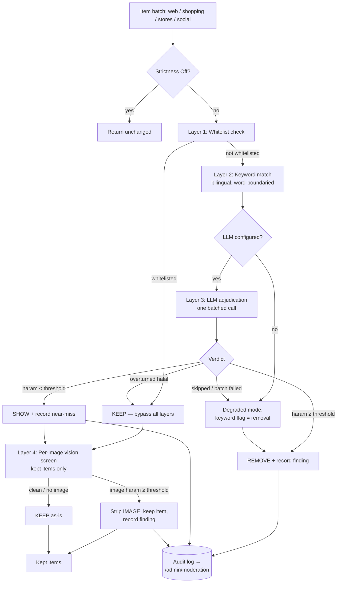

# Halal Content Moderation

> How Daleel keeps haram content out of results without hiding legitimate products.
> Everything here is drawn from the actual source (`src/Daleel.Core/Moderation/*` and
> `src/Daleel.Web/Moderation/*`, plus the enrichment `ImageCheckHandler` and the agent
> `PromptTemplates`). When the code and this doc disagree, the code wins; fix the doc.

Daleel is an Arabic-first shopping assistant for a Muslim audience, so moderation is a
first-class product concern, not an afterthought. But the design's guiding fear is the
**wrong** kind of filtering: hiding a perfectly halal fridge because its seller's name
tripped a substring, or blanking every product image because a vision key ran out of
credits. The whole pipeline is built around one asymmetry — **showing a questionable
listing costs less than hiding a legitimate one** — and around one hard rule: moderation
must *never* fault a search.

---

## 1. What is (and isn't) moderated

The filter screens haram **content** — what a result actually sells, shows, or promotes —
never a store's **business model**.

| Category | Min strictness | Examples (EN) |
|----------|----------------|---------------|
| alcohol | Moderate | beer, wine, whisky, vodka, liquor, brewery, pub, **bar**, spirits, cider… |
| pork | Moderate | pork, bacon, ham, lard, prosciutto, non-halal… |
| gambling | Moderate | casino, betting, lottery, poker, roulette, slots, bookmaker… |
| adult | Moderate | porn, xxx, nude, escort, erotic, sex shop… |
| drugs | Moderate | cannabis, cocaine, heroin, narcotics, hashish… |
| tobacco | **Strict** | cigarette, cigar, vape, shisha, hookah, nicotine… |
| immodest | (vision only) | a visible woman not in full hijab / revealing clothing |

`FilterStrictness` (in `ContentFilter.cs`) has three levels: `Off` (an admin-only escape
hatch), `Moderate` (the five core categories), and **`Strict` — the default — Moderate
plus tobacco**.

### The riba exclusion (a load-bearing non-feature)

There is **intentionally no "riba" / "banking" category**. A store's *financing model*
(interest-based installment plans, a bank, a retailer offering credit) is **never** screened
at any strictness level — the user can walk in and pay cash for a halal TV, so filtering the
store would wrongly hide a legitimate option over a payment method the customer need not
use. A Strict-level "riba" category existed once and was deliberately removed because it
conflated financing with the halal status of what a store sells.

This exclusion is enforced in **four independent places** so no single prompt drift or model
hallucination can bypass it:

1. `HalalPolicy.NeverFiltered` — a hard set (`riba`, `interest`, `banking`, `bank`,
   `finance`, `financial`, `insurance`, `loans`, `mortgage`) that the text parser, the vision
   parser, and the moderator all subtract from any verdict.
2. `LlmHalalClassifier.SystemPrompt` explicitly says *"NEVER flag: banks, loans,
   interest/riba financing, insurance."*
3. `VisionPolicy.Compose` refuses to even *describe* a never-filtered category to the vision
   model.
4. `PromptTemplates.HalalGuard` (appended to every planning/analysis prompt) repeats it.

`QueryPreScreen` goes one step further: a financial-**product** query ("best loans",
"قرض") is not blocked but *steered* — rewritten to `"… islamic sharia-compliant"` so results
surface halal financing instead. That is the product-search case, distinct from a store that
merely offers riba installments (never touched).

---

## 2. The layered moderator

Two filtering surfaces exist. The legacy **`ContentFilter`** does keyword-only removal at
coarse chokepoints (`FilterDeals`, `FilterStores`, `FilterSocialPosts`, and the generic
`FilterResults<T>`). The richer **`HalalModerator`** composes three text layers plus a vision
layer at item granularity and is where the interesting decisions live. Both share one
`ContentFilter` instance, which carries the audit log for the run.

### Layer 1 — Whitelist

`ContentFilter.IsWhitelisted(sourceUrl, imageUrl, contentHash)` checks an item's three stable
keys against the admin-managed whitelist. A hit **bypasses every downstream layer** — it is
the feedback loop's "undo". Whitelisting by `contentHash` (a lowercased, whitespace-collapsed
SHA-256 from `ModerationKeys.HashContent`) un-hides the same content wherever it reappears,
not just the one URL.

### Layer 2 — Keyword (the always-on baseline)

Deterministic, bilingual, and free. `ContentFilter.MatchDetail` runs each active category's
compiled regex against the text and reports the first hit plus the exact matched term (so the
admin log can show *which* word fired). It works with zero API keys, so the pipeline is never
without a baseline.

Crucially, a keyword hit is a **candidate**, not a verdict — when an LLM is configured, every
keyword flag is re-judged in context before it can remove anything.

### Layer 3 — LLM adjudication

`HalalModerator.AdjudicateAsync` collects all keyword-flagged (and unflagged) candidates into
a single batched call to `LlmHalalClassifier` (`BatchSize = 80`, each item's text truncated to
280 chars). The classifier's prompt frames the model as an item-level moderator — *"A store
that sells electronics alongside some alcohol is fine as a store: only the alcohol ITEMS are
haram"* — and tells it the keyword hint is **not evidence**, only a reason the item was
surfaced. The model must confirm from what the item *itself* sells.

The adjudication outcomes:

- **Overturned** — the model returns `haram: false` for a keyword-flagged item ("Barber
  shop", "hotel near the Bar district"): the flag is dropped, the item kept.
- **Confirmed above the bar** — `haram: true` with confidence ≥ the per-category threshold:
  removed, finding recorded.
- **Confirmed below the bar** — `haram: true` but a hesitant confidence: the item is **shown**
  (show-by-default), and the near-miss is recorded so an admin can rate it.
- **LLM-only flag** — the model catches haram content the keyword list missed; gated by the
  same per-category threshold.
- **Skipped** — the model answered the batch but didn't mention this hinted item: treated as a
  probable false positive, shown and recorded.

### Degraded mode — the fail-open contract

`HalalModerator`'s failure contract is explicit: **classifier errors degrade to keyword-only
behavior; moderation never faults a search.** `FinalizeKeywordFlags` promotes any keyword flag
the LLM *never adjudicated* into a removal — this covers three cases: no LLM configured, the
whole call threw, or a batch failed.

That last case is subtle and handled by `HalalClassifierResult.UnansweredIds`: a *partial*
infrastructure failure (batch 2 of 4 timed out) must not read as *"the model chose to show
those items."* The failed batch's ids are reported unanswered, the deterministic keyword
baseline applies to exactly them, and the other batches' adjudication is kept.

---

## 3. Show-by-default and the confidence thresholds

The `HalalPolicy` record encodes the show-by-default bias numerically:

- `DefaultThreshold = 0.8` — the minimum model confidence to *remove* an item. Deliberately
  high. Anything below is shown and logged.
- `MaxImagesPerRun = 24` — the vision cost guard (a per-run budget shared across sub-workflows).
- `CategoryThresholds` — per-category removal thresholds **learned from admin ratings**.

`HalalPolicy.ThresholdFromPrecision(correct, incorrect)` derives a category's threshold from
admin feedback: `precision = correct / rated`, then `clamp(0.65 + (1 - precision) * 0.3, 0.65,
0.95)`. A category admins keep marking "incorrect" gets a **higher** bar (the model must be
more certain before hiding that kind of item); a well-rated category is trusted down to 0.65.
The floor stays above chance on purpose — even a trusted category keeps the show-by-default
bias. Categories with fewer than `minSample = 5` ratings keep the default.

### Haram-wins dedupe

Models sometimes emit the same item twice (the prompt asks for one object per haram item
*and* one per hinted item, and a hinted-and-haram item matches both clauses). Every id-keyed
lookup — in `LlmHalalClassifier.ParseVerdicts`, in `HalalModerator.AdjudicateAsync`, and in the
image-verdict map — resolves duplicates the same way: **a haram verdict wins over a halal
one.** This is a deliberate fail-safe toward compliance, and it means callers can rely on at
most one verdict per id.

---

## 4. Arabic word-boundary matching

Arabic matching is the part most likely to go wrong, and the code carries scar tissue from it.

The naive approach — substring matching — was *"a false-positive machine"*: the term `بار`
(bar) fires inside `الغبار` (dust), `أخبار` (news), and `بارد` (cold); a dehumidifier ad got
flagged as alcohol in production. So both the English and Arabic keyword paths are
**word-boundaried**.

English compiles once into `\b(?:beer|wine|…)s?\b` (case-insensitive, culture-invariant, with
an optional trailing "s"), so "bar" catches "City Bar" and "bars" but not "barber".

Arabic terms are first normalized via `ArabicNormalizer` (so hamza/alef/taa-marbuta
orthographic variants all collapse to one form), then compiled into an alternation guarded by
Unicode **letter boundaries** `(?<!\p{L}) … (?!\p{L})` — `\b` is unreliable across the mixed
Arabic/Latin text these fields carry.

The tricky bit is prefixes. Arabic fuses the definite article and single-letter clitics onto
the front of a word, so `البار` ("the bar") must still match `بار`. The pattern therefore
tolerates **only the definite-article family**: `ال`, `لل`, and the fused `وال / فال / بال /
كال / ولل / فلل`. Bare single-letter clitics (`و / ف / ب / ك / ل`) are **deliberately not
tolerated** — allowing them re-created the bug one word over: `كبيرة` ("big") normalizes to
`ك+بيره` and matched "beer"; `كبار` ("adults") matched "bar". Rare genuine forms like `وبيرة`
are the LLM layer's job; the keyword layer stays high-precision on purpose.

---

## 5. The image halal classifier and vision policy

`OpenRouterImageHalalClassifier` (`IHalalImageClassifier`) sends batches of `image_url` parts
(`BatchSize = 8`) to a vision-capable model over OpenRouter's chat-completions endpoint. It
exists because the text-only `ILlmClient` can't speak multimodal, and it mirrors the wire
format of the product-identification `VisionMatcher`.

### The VisionPolicy (admin-composed)

The system prompt is **not** a hardcoded string — it is composed by `VisionPolicy.Compose`
from a *list* of `Rule(category, instruction)` records. `VisionPolicy.DefaultRules` seeds the
built-in policy (alcohol, pork, gambling, adult, drugs, tobacco, and the detailed `immodest`
rule), but admins edit the live rule list on `/admin/moderation`, persisted as
`ImageModerationRule` rows and read through `IImageModerationRuleRepository`.

The `immodest` rule is the most carefully worded: it flags *"a real, living WOMAN who is
visible and is NOT in full hijab"* and explicitly narrows to **only when an actual person is
visible** — a product-only shot, a garment on a mannequin or a headless dress form, folded
items, shoes, electronics, and logos are all fine; men, children, and women in full hijab are
never flagged. This precision is what keeps the screen from blanking half a clothing catalogue.

`OpenRouterImageHalalClassifier.ResolvePolicyAsync` reads the active rules once per screen (not
per batch) so every batch judges by the same policy, and falls back to the built-in default on
any read failure. `VisionPolicy.AllowedCategories` computes the parser's accept-set as the
built-in halal categories **∪** the rules' own categories **∖** `NeverFiltered` — so an
admin-added category is honoured, and riba can never sneak in.

### Verdict caching

Screening the same product photo across searches would re-pay every time, so verdicts are
cached by image URL through `ICacheStore` (`CacheKeyPrefix = "halal-image:"`, TTL 30 days). A
cached haram verdict re-flags; a cached clean verdict records nothing. Admin re-evaluation
passes `bypassCache: true` so a rule change actually re-judges the image instead of returning
the stale verdict (the fresh verdict then refreshes the cache).

### Fail-open at gather, fail-closed at the gate

The image screen appears **twice** in the pipeline, with opposite failure modes — this is the
key safety design:

- **During gather** (`HalalModerator.ModerateImagesAsync`) the screen is **best-effort /
  fail-open**: a failed vision pass leaves images untouched, because an unscreened raw image
  is re-screened later by a fail-closed unit before the user ever sees it. It only consumes
  the `Flagged` set here.
- **At the final grid** (`ImageCheckHandler`, the `enrich.imagecheck` enrichment unit) the
  screen is **fail-closed**. Product/brand images are hidden **by default** — the UI renders
  `DisplayImageUrl`, which is null until this unit *promotes* an image into `VerifiedImages`.
  Only images that were actually screened *and* judged clean (and pass the product-shot screen)
  are promoted. Flagged images, `Unscreened` images (the screen couldn't run — OpenRouter 402
  out-of-credits, a 5xx, a timeout), non-product-shots, and anything beyond the cap all stay
  hidden.

Nothing is destructively stripped: the raw URL is kept, so an admin whitelist or a retry can
un-hide it. When images couldn't be screened, the unit **requeues** (`InfraBackoff = 5 min`,
no attempt consumed) and holds them hidden until the outage clears — it never shows an
unverified image. A *missing* vision model is treated as moderation-off (a deployment choice)
and passes images through; fail-closed hiding is scoped strictly to a *configured* screen that
can't *run*, so a missing key can't blank the whole app.

> The `ImageClassifierResult` type exists precisely to let a caller tell "verified clean"
> (URL in neither `Flagged` nor `Unscreened`) from "could not verify" (`Unscreened`) and fail
> closed on the latter. Its text-layer sibling is `HalalClassifierResult.UnansweredIds`.

A separate, product-agnostic `IProductImageScreen` (`OpenRouterProductImageScreen`) then drops
images that aren't clean product shots — logos, promo banners, collages. It is **fail-open**
(a vision outage rejects nothing), so it only ever removes a bad photo, never hides a good one.

---

## 6. Image-strip ≠ removal

When the vision screen flags an image on a *kept* item, `HalalModerator.ModerateImagesAsync`
**strips the image and keeps the item** — it rebuilds the item via the projection's
`WithImageUrl(item, null)` and records a finding with `ItemRemoved: false`. Granularity is per
image, per item, **never per site**: a haram photo on one listing doesn't remove the listing,
let alone the store. The admin log distinguishes the two — `AuditLog` (the legacy string log
that `FilteredCount` derives from) counts *removals only*, while `AuditDetails` also carries
image-strip and below-threshold "shown" findings whose items survived.

Every finding is a structured `FilterFinding`: category, rule/term, kind, content snippet,
which field tripped, source URL, image URL, confidence, `FindingSource` (Keyword / Llm /
Vision), content hash, and the `ItemRemoved` flag. Findings are **server/admin-only — never
surfaced to end users**; they exist to be rated and whitelisted on `/admin/moderation`.

---

## 7. Dynamic rules and the auto-reviewer

The keyword layer is not frozen in code. `ModerationRule` records (`suppress-term` /
`add-term`, with category, term, and language) are stored as **data**, so the filter can learn
without a deploy. `ContentFilter.BuildCategories` compiles the *effective* category set once
per policy snapshot: suppressions drop a trigger term, additions extend a category. With no
rules, it returns the shared defaults untouched.

`ModerationPolicyProvider` assembles the per-run `ModerationPolicySnapshot` — the active
whitelist, the feedback-tuned thresholds (from `RatingStatsAsync` over a 90-day window), and
the effective categories — cached for 5 minutes so runs don't hammer the tables. Policy loading
is itself best-effort: a load failure falls back to empty whitelist, stock thresholds, and
static categories rather than blocking the search.

### The LLM auto-reviewer

`AutoReviewEngine` (driven by the `FindingAutoReviewService` background service every 15
minutes) is the dynamic half of the feedback loop. Each cycle it audits a batch of
`BatchSize = 40` unreviewed findings with a fresh LLM pass that judges the **content itself**,
independently of the original decision, and — like the classifier — is told the trigger term
is not evidence.

Two things come out of a cycle:

1. **Auto-ratings** land as `AutoRating` values (haram → +1, halal → −1), feeding the same
   threshold tuning as admin ratings. **Admin ratings always override.**
2. **Term suppressions self-activate** when the same keyword term keeps producing wrong flags.
   `MaybeSuppressTermAsync` requires **consensus** — `SuppressionConsensus = 3` findings of
   that term audited halal, **zero** audited haram, and **no admin** having marked any finding
   of it haram. That last condition is the **human veto**: if any admin says a term is
   catching real haram, the machine may not silence it.

The asymmetry is deliberate. Auto-**suppression** (dropping a blocker) is the safe,
false-positive-reducing direction, so it activates on machine consensus. Auto-**addition** (a
new blocker the auditor proposes) is the risky direction, so those stay **"pending"** for
one-click admin approval — a human stays in that path. When rules change, the engine calls
`ModerationPolicyProvider.Invalidate` so the very next search runs on the updated set.

---

## 8. The relevance gate's HalalGuard tie-in

Deterministic shopping hits (SerpAPI → listing) reach the grid **without** any LLM pass, so
the post-aggregation **relevance gate** (`PromptTemplates.RelevanceGate` /
`RelevanceGateSystem`) is the last content check on that path. Its primary job is relevance —
*"is this item ITSELF an instance of the product type?"* (a milk frother is not a coffee
maker) — but its instructions also carry `HalalGuard` and tell it to *"drop any item that is
haram/immodest content."* The gate returns only indices to **drop**, so an item the model
overlooks fails open (kept), and a resemblance alone is never a drop (guarding against a
runaway feedback loop). Note the target and item names it judges are `PromptSanitizer.Neutralize`d
first — they're derived from untrusted scraped pages (see the [Security](/security) doc).

---

## 9. Concurrency and thread-safety

One `ContentFilter` (and one `HalalModerator`) is shared **by reference** across up to five
parallel sub-workflows (the moderation chokepoint). So:

- `ContentFilter`'s audit lists (`_audit`, `_details`) are guarded by `_auditLock`; readers
  (`AuditLog`, `AuditDetails`) return snapshots. An unlocked `List.Add` from parallel threads
  would corrupt the backing array.
- `HalalModerator`'s per-run image budget is claimed atomically with an
  `Interlocked.CompareExchange` loop, because several lists (web, shopping, stores, social) are
  moderated against one shared `MaxImagesPerRun`.

---

## Key files

| File | Role |
|------|------|
| `src/Daleel.Core/Moderation/ContentFilter.cs` | Bilingual keyword filter; category defaults + Arabic/English boundary regexes; `BuildCategories` (dynamic rules); audit log. |
| `src/Daleel.Core/Moderation/HalalModerator.cs` | Item-level pipeline composing whitelist → keyword → LLM → vision; show-by-default, haram-wins dedupe, image-strip. |
| `src/Daleel.Core/Moderation/HalalClassification.cs` | `FilterFinding`, `HalalPolicy` (thresholds, `NeverFiltered`, precision tuning), classifier/image-classifier interfaces, result types. |
| `src/Daleel.Core/Moderation/LlmHalalClassifier.cs` | `IHalalClassifier` over `ILlmClient`; batched text adjudication; `ParseVerdicts` policy backstop. |
| `src/Daleel.Core/Moderation/ModerationRule.cs` | The `suppress-term` / `add-term` dynamic rule record. |
| `src/Daleel.Web/Moderation/OpenRouterImageHalalClassifier.cs` | Multimodal `IHalalImageClassifier`; policy resolution, verdict caching, `Unscreened` fail-closed contract. |
| `src/Daleel.Web/Moderation/VisionPolicy.cs` | Vision policy as an editable rule list; `Compose` (prompt), `AllowedCategories`, riba exclusion. |
| `src/Daleel.Web/Moderation/ProductImageScreen.cs` | Fail-open `IProductImageScreen` that drops non-product-shot images (logos/banners/collages). |
| `src/Daleel.Web/Moderation/FindingAutoReviewService.cs` | `AutoReviewEngine` + 15-min background service; consensus suppressions, pending additions, admin veto. |
| `src/Daleel.Web/Moderation/ModerationPolicyProvider.cs` | Per-run snapshot: whitelist + feedback thresholds + effective categories; 5-min cache, `Invalidate`. |
| `src/Daleel.Web/Moderation/QueryPreScreen.cs` | Zero-cost submission gate: blocks haram consumables, steers riba product queries to sharia-compliant. |
| `src/Daleel.Web/Pipeline/Enrichment/ImageCheckHandler.cs` | The fail-CLOSED final-grid image gate; promotes `VerifiedImages`, requeues on outage, writes the `/admin/images` audit. |
| `src/Daleel.Agent/PromptTemplates.cs` | `HalalGuard` (appended to planner/analyst prompts) and the relevance-gate prompts. |

## Cross-references

- Prompt-injection defense of the untrusted content these classifiers judge: [security.md](/security)
- Overall architecture, DI wiring, and the SSRF/CSP layers: `docs/wiki/03-architecture.md`
