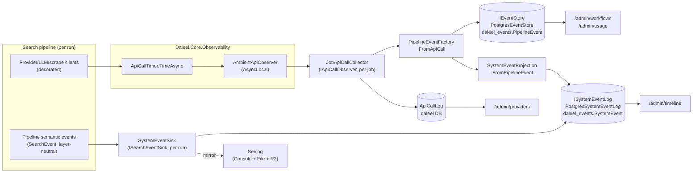

# Observability & admin

> How operators see inside a run: the `/admin/*` pages, the two event stores, and the metering
> that feeds them. Grounded in the actual source (`src/Daleel.Web/Components/Pages/Admin/*`,
> `src/Daleel.Web/Events/*`, `src/Daleel.Core/Observability/*`) — when the code and this doc
> disagree, **the code wins**; fix the doc. Every `/admin/*` page carries
> `[Authorize(Roles = "Admin")]`.

---

## 1. The admin pages

All admin pages hang off `AdminNav` and are Blazor Server components (interactive, server-only
DI). The observability-relevant ones:

| Route | Page | What it shows |
|-------|------|---------------|
| `/admin/workflows` | `AdminWorkflows.razor` | Running/queued + completed search runs; per-run step-timeline drill-down; cost/step rollup. |
| `/admin/queues` | `AdminQueues.razor` | Enrichment work-queue counts, per-kind breakdown, **dead-unit ledger with reason strings**, search-job + edge-poll-drain stats. |
| `/admin/timeline` | `AdminEventTimeline.razor` | Unified `SystemEvent` feed — server-paged, filterable by category/severity/run/text, JSON export. |
| `/admin/providers` | `AdminProviderEfficiency.razor` | Every individual provider call — request, response summary, ms, cost, status; the **"paid for nothing"** filter. |
| `/admin/images` | `AdminImages.razor` | Image-moderation audit: shown / hidden / unscreened, with category + confidence + reason; re-queue for re-screening. |
| `/admin/moderation` | `AdminModeration.razor` | Halal content-filter stats, whitelist, and dynamic rules. |
| `/admin/usage` | `AdminUsage.razor` | Aggregate usage + cost report (from the `IEventStore` firehose). |

### `/admin/workflows` — run timeline

Reads `DaleelDbContext.SearchJobs` for the running (`Running`/`Queued`) and completed
(`Completed`/`Failed`/`Cancelled`) lists. The completed grid is bounded to the newest
`CompletedCap = 200` by PK, then window-filtered (`today` / `7d` / `30d`) in memory. Cost and
step counts come from **one** event-store call — `IEventStore.SummarizeBySearchAsync(ids)` —
to avoid an N+1; when Postgres isn't configured those columns show "—".

Clicking a run opens the **step-timeline drill-down**: `IEventStore.ForSearchAsync(jobId)`
returns every `PipelineEvent` of that run (oldest first) rendered as a `MudTimeline` of
provider calls with per-step ms + USD. For a **failed/cancelled** run it also surfaces the
real exception (`SearchJob.Error`) and last step (`ProgressMessage`) — often the *only* clue,
since the fault can happen before any provider call was recorded.

> The event-name histogram across a run's timeline is the fastest way to see **which stage
> produced or lost data**.

Concurrency note: the shared scoped `DaleelDbContext` isn't thread-safe, so a `SemaphoreSlim`
serializes every DB access — a manual reload and a 5s auto-refresh tick can never run two
operations on it at once.

### `/admin/queues` — enrichment work queue + dead-unit ledger

Pulls a `QueueDashboard` snapshot per tick from `IQueueDashboardService` (resolved in a
**fresh DI scope** each tick — the service and its DbContext must never live on the circuit).
Live-refreshes every 5s. Surfaces:

- **Work-queue tiles**: Pending, Running, Processed, **Recovered** (failed at least once then
  completed — the retry machinery working), **Dead** (gave up after exhausting retries), and
  Oldest-pending age.
- **Per-unit-kind table**: pending/running/processed/dead, avg attempts, avg time-to-done.
- **Dead units (most recent)**: kind, job #, attempts, **reason string** (`LastError`), when.
  The `EnrichmentWorkItems` table *is* the queue — per-unit retry + a dead ledger, no
  watchdogs. When you see a dead reason, grep that string into the handler.
- **Search jobs** and the **edge poll drain** (Cloudflare execution layer): drained results,
  edge failures, recent failure detail. If the event log isn't configured, the drain counters
  are unavailable.

### `/admin/timeline` — unified `SystemEvent` feed

The one chronological, searchable feed of *everything*. A `MudDataGrid` with `ServerData`
calls `ISystemEventLog.QueryAsync(SystemEventQuery)` — server-paged, newest first. Filters:
time-range presets (hour/today/7d/30d/all), multi-select **category** and **severity** chips,
free-text (350ms debounce), and click-to-filter by **run** (`CorrelationId`). Rows expand to
show the jsonb `DetailsJson`. Auto-refresh (5s) and JSON export (bounded by the store's
`WindowCap`). When Postgres isn't configured the page shows a "not configured — set
`POSTGRES_CONNECTION_STRING` / `DATABASE_URL`" hint.

### `/admin/providers` — provider efficiency

Reads `IApiCallLogRepository.RecentCallsAsync(since, limit: 500, provider)` from the
`ApiCallLog` table (in the main `daleel` DB). One row per external provider call: time,
provider, endpoint, request summary, **response summary**, ms, cost, status. Its reason for
existing is the **"Paid for nothing"** toggle — a call we *paid* for that returned nothing
usable (e.g. Context.dev billing credits to answer "0 product(s)"). `IsBarren` flags
`EstimatedCost > 0` with a response summary that starts `"0 "` / `"empty"` / `"no profile"`;
errors are excluded (they already cost nothing).

### `/admin/images` — image-moderation audit

One row per image the halal **vision** screen looked at, from `IImageModerationLogRepository`.
Each is **shown** (verified clean), **hidden** (flagged haram — with category, confidence
score and reason), or **unscreened** (the screen couldn't run — held hidden, fail-closed).
Admins select images (or "re-evaluate all matching") to **re-queue** them for re-screening
against the current rules; a background worker re-judges and updates the verdict. Anonymous by
design — no user is recorded.

### `/admin/moderation` — halal whitelist + rules

Content-filter KPIs (items filtered / searches with removals over 30d), most-filtered
categories, and the editable **whitelist** (`IModerationWhitelistRepository`) + dynamic
**rules** (`IModerationRuleRepository`, `IImageModerationRuleRepository`). Rules are seeded
from built-in defaults on first run and stay admin-editable.

---

## 2. The event stores

Two append-only stores live in the **`daleel_events`** Postgres database (separate from the
app `daleel` DB), plus one audit table in the app DB.

### `IEventStore` — the pipeline firehose (`daleel_events.PipelineEvent`)

The append-only, provider-shaped cost/usage store. One `PipelineEvent` per action — a provider
call, scrape, LLM completion, cache hit/miss, or profile lookup — with `Category`, `EventType`,
`Provider`, `SearchId` (= `SearchJob.Id`, correlates a run), `DurationMs`, `EstimatedCost`,
`Success`, and a free-form jsonb `MetadataJson`. Rows are written, never updated.

- Implementation: **`PostgresEventStore`** (singleton, opens its own scope per write), or
  **`NullEventStore`** when no Postgres is configured (`IsEnabled = false` — the dashboards show
  a "not configured" hint). Writes are **best-effort**: a write failure must never fail a
  search.
- Powers `/admin/usage` (`GetUsageAsync` → `UsageReport`), `/admin/workflows` cost columns
  (`SummarizeBySearchAsync`), and the run drill-down (`ForSearchAsync`).

> **Historical note:** an earlier design had a SQLite `ApiCallLog`-backed analytics store as the
> default with Postgres optional. The SQLite backend is **gone** — Daleel is Postgres-only now;
> both event stores are Postgres (`PostgresEventStore`, `PostgresSystemEventLog`) with `Null*`
> no-ops when Postgres is absent. The `ApiCallLog` table survives, but as a table in the app DB
> (below), not a separate event-store backend.

### `ISystemEventLog` — the unified timeline (`daleel_events.SystemEvent`)

The store behind `/admin/timeline`. One `SystemEvent` per thing that happened *anywhere* — a
search lifecycle transition, a pipeline action, a user login, a background sweep, an error —
with a coarser, user-facing `Category` (`SystemEventCategory`: search, workflow, brand, store,
item, cache, llm, user, maintenance, error), `Severity` (info/warning/error), `Source`,
`Summary`, jsonb `DetailsJson`, `CorrelationId`, and a **hashed** `UserHash` (one-way
`Anonymizer.HashUserId` — never the raw id, so the timeline can't be traced back to an account).

- Implementation: **`PostgresSystemEventLog`** (singleton) or **`NullSystemEventLog`**. Writes
  are best-effort and must never throw into the caller (recording an event must not fail a
  search, a login, or a sweep).
- Convenience: `SystemEventLogExtensions.LogAsync(category, type, summary, …)` keeps emission
  sites one-liners.

### The firehose → timeline bridge

The timeline does **not** re-instrument the twenty-odd pipeline activities. Instead:

- **`SystemEventProjection.FromPipelineEvent(pe, userHash)`** (pure, static, unit-testable)
  re-buckets each provider-shaped `PipelineEvent` into a coarser `SystemEvent`. The event type
  wins over the provider category when it names an entity — `.Contains("brand")` → Brand,
  `"store"` → Store, `"item"` → Item, `"cache"` → Cache, `"workflow"` → Workflow; otherwise it
  falls back on the provider category (Places → Store, Scrape/Profile → Item, LLM → Llm).
  Pipeline events carry no identity, so the flush site (which knows the owning
  `SearchJob.UserId`) supplies the hashed user.
- **`SystemEventSink`** (`ISearchEventSink`, one per run, from `SystemEventSinkFactory`) maps
  the pipeline's *layer-neutral* `SearchEvent`s — the channel discovery/extraction/failover
  report progress through — into `SystemEvent`s stamped with the run's correlation id + user
  hash, via a `SystemEventWriter` (no DB work on the hot path). It **also mirrors** every event
  to Serilog (Console + File + R2) under a stable source context — without this, the pipeline
  trail reached the timeline but not the file/R2 log sinks.
- **`PipelineEventFactory.FromApiCall(call, searchId)`** (pure, static) is the other feeder:
  it projects the `ApiCall` telemetry that every wrapped provider emits into a `PipelineEvent`,
  keying its category off the same shape `CostEstimator.EstimateCall` uses so cost and category
  stay consistent.

### `ApiCallLog` (app `daleel` DB)

The per-call audit table behind `/admin/providers`, written via `IApiCallLogRepository`. Holds
provider, endpoint, request/response summaries, ms, `EstimatedCost`, and status — the
granularity the aggregate usage report can't show (a call that billed to return nothing).

### Startup migration gate

`EnsureDatabase` in `Program.cs` migrates the app DB (`daleel`, created if absent), then
**best-effort** migrates `daleel_events` via the `EventStoreDbContext` factory — gated on the
**factory** being registered (i.e. Postgres configured), not on `IsEnabled`. A transient
failure there degrades to dropping events, never stops the app.

---

## 3. Metering: `AmbientApiObserver` + `ApiCallTimer`

Every paid call is timed, classified, cost-estimated, and recorded — always, even when it
throws.

- **`ApiCallTimer.TimeAsync(observer, estimator, provider, endpoint, summary, action, …)`**
  centralizes the try/finally + stopwatch so every provider decorator stays a one-liner. It
  emits an `ApiCall` with the outcome. A `success` predicate lets a call that *returned* but
  didn't *deliver* (e.g. an edge worker returning `Success == false` instead of throwing) be
  recorded as `Error` at **zero cost** — so a failed-edge-then-inline-fallback bills **once**,
  not twice. A `describe` callback records *what the call returned* ("0 products") for the
  efficiency view, without ever storing a raw body. A **null observer no-ops** (tests, admin
  tools, startup work = "unmetered context").

- **`AmbientApiObserver`** carries the current job's observer + cost estimator on an
  `AsyncLocal`. One `Begin(collector, estimator)` at the top of a run/enrichment covers **every**
  paid call underneath it — including `Task.WhenAll` fan-outs, DI-scope creation, and
  sub-workflow children — with no plumbing through signatures. This exists because DI-resolved
  components (the vision matcher, brand-catalogue searcher, store crawls) make paid calls on
  their own HTTP clients and previously **bypassed** metering entirely — real spend that never
  reached the dashboard. Those call sites now read the ambient observer. Parallel jobs are
  separate async flows, so their scopes never bleed into each other.

- **`JobApiCallCollector`** (`IApiCallObserver`, one per job) records each `ApiCall` to the
  internal audit sink, keeps a running `TotalCost`, and accumulates calls for persistence. It's
  thread-safe (providers run in parallel during gather). `TotalCredits` bills for **delivered
  work only** — a failed/timed-out call (incl. a failed-edge attempt that fell back inline)
  delivered nothing and isn't charged, so a worker outage can't double-bill every page it
  degrades.

### The per-job "cost cap" is metering, not a live kill-switch

- **Metering only (R1):** cost **never** cancels an in-flight job. An in-flight deep-dive is
  never interrupted for spend. The spend gate is the pre-search **credit** check
  (`QuotaService.QuotaStatus.CanSearch`) — you may start a search while you have any credits;
  the actual cost is charged to credits *post-hoc* (`ChargeCreditsAsync`) after the run
  finishes. Admins bypass the gate.
- **The per-job cost cap is currently dormant.** With the uncapped fan-out design, the cost cap
  is not armed for any fan-out (`PipelineLimits` / `SystemConfigService` note that nothing reads
  the old cap settings). The real backstops are the **workflow deadline + salvage**, the
  **per-unit lease + retry budgets**, and **freshness gates** — never a result count. Code
  comments still reference "cost cap" as the *intended* non-retryable give-up reason on dead
  units; treat it as a design hook, not an active limiter today.

---

## 4. Logs: the log-viewer Worker vs. QA

Warning+ logs are written as JSON-Lines to the `daleel-logs` R2 bucket (or local files when R2
is unset), under a `logs/` prefix — see `SerilogConfiguration`.

> **The log-viewer Worker reads PROD `daleel-logs` only.** Its admin integration is wired
> through `LOG_VIEWER_URL` + `LOG_VIEWER_AUTH_TOKEN` (the same bearer the worker deploy uploads
> as its `AUTH_TOKEN`). For **QA**, there is no log-viewer path — use SSH `docker logs` on the
> QA box (1Password-gated key) or the admin UI (`/admin/timeline`, `/admin/workflows`).

`/logs/search` gotchas (the Worker's own UI): `since=` is a **file-level** filter (filter
`Timestamp` client-side), the 1000-line cap is **oldest-first** (rare-term queries surface
recent runs), and the query is a plain substring match (`q=422` also hits timestamps).

---

## 5. Reading a run end-to-end

1. **`/admin/workflows`** → find the run (or watch it live); click it. The step timeline's
   event-name histogram shows which stage produced or lost data. A failed run shows its real
   `Error` + last `ProgressMessage`.
2. **`/admin/timeline`** → click the run's `#CorrelationId` to see *every* system event for it —
   pipeline actions, cache decisions, entity work, errors — in one feed. Expand a row for its
   jsonb detail.
3. **`/admin/queues`** → if items are missing, check the dead-unit ledger; the reason string
   points at the failing handler.
4. **`/admin/providers`** → if the run cost more than it should, the "Paid for nothing" filter
   shows calls billed for empty results.

> "No results just yet" can be a **FAULTED** run, not an empty one — the UI states are
> identical; the real exception is server-side (`SearchJob.Error`, shown in the workflows
> drill-down) or in `docker logs`.

---

## Key files

| Path | What it is |
|------|------------|
| `src/Daleel.Web/Components/Pages/Admin/AdminWorkflows.razor` | Run timeline + step-timeline drill-down; cost/step rollup via `IEventStore`. |
| `src/Daleel.Web/Components/Pages/Admin/AdminQueues.razor` | Enrichment queue tiles, per-kind table, dead-unit ledger, search-job + edge-drain stats. |
| `src/Daleel.Web/Components/Pages/Admin/AdminEventTimeline.razor` | Server-paged unified `SystemEvent` feed with filters + export. |
| `src/Daleel.Web/Components/Pages/Admin/AdminProviderEfficiency.razor` | Per-call provider log + "paid for nothing" filter. |
| `src/Daleel.Web/Components/Pages/Admin/AdminImages.razor` | Image-moderation audit (shown/hidden/unscreened) + re-queue. |
| `src/Daleel.Web/Components/Pages/Admin/AdminModeration.razor` | Halal filter stats, whitelist, dynamic rules. |
| `src/Daleel.Web/Events/IEventStore.cs` | The `PipelineEvent` firehose interface + `NullEventStore`. |
| `src/Daleel.Web/Events/PostgresEventStore.cs` | Postgres impl of the firehose (`daleel_events`). |
| `src/Daleel.Web/Events/PipelineEvent.cs` | Provider-shaped cost/usage event + `EventCategory`. |
| `src/Daleel.Web/Events/ISystemEventLog.cs` | The unified timeline log interface + `LogAsync` helper + `NullSystemEventLog`. |
| `src/Daleel.Web/Events/PostgresSystemEventLog.cs` | Postgres impl of the timeline log. |
| `src/Daleel.Web/Events/SystemEvent.cs` | Timeline event + `SystemEventCategory` / `SystemEventSeverity`. |
| `src/Daleel.Web/Events/SystemEventProjection.cs` | Pure `PipelineEvent` → `SystemEvent` re-bucketing (the firehose bridge). |
| `src/Daleel.Web/Events/SystemEventSink.cs` | Per-run `ISearchEventSink` → `SystemEvent` + Serilog mirror. |
| `src/Daleel.Web/Events/PipelineEventFactory.cs` | Pure `ApiCall` → `PipelineEvent` projection. |
| `src/Daleel.Core/Observability/AmbientApiObserver.cs` | `AsyncLocal` carrier for the current job's observer + estimator. |
| `src/Daleel.Core/Observability/ApiCallTimer.cs` | Times/classifies/costs every external call; null-observer no-op. |
| `src/Daleel.Web/Conversation/JobApiCallCollector.cs` | Per-job `IApiCallObserver`: running cost + delivered-work credits (R1 metering). |
| `src/Daleel.Web/Data/ApiCallLogRepository.cs` | Per-call audit table (`ApiCallLog`, app `daleel` DB) behind `/admin/providers`. |
| `src/Daleel.Web/Pipeline/Enrichment/QueueDashboardService.cs` | The `QueueDashboard` snapshot behind `/admin/queues`. |
