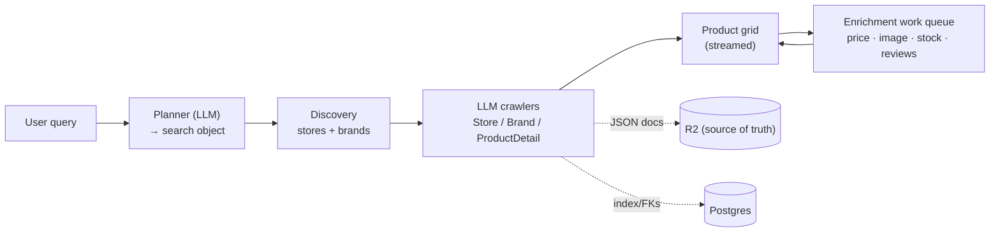

# Overview & Architecture

**Daleel** (دليل — Arabic for "guide") is an AI product & price-comparison search app for MENA markets
(default: **Jordan**). You type what you want to buy — "inverter AC in Amman", "washing machine in
Jordan" — and Daleel runs an LLM-driven pipeline that **discovers** relevant stores and brand sites,
**scrapes** them, **extracts** structured product data, and **enriches** each item with prices, images,
stock, and reviews, streaming the results into a live, filterable grid. Arabic and English throughout.

This page is the map. Each subsystem has its own page; follow the links.

---

## The one-paragraph shape

A query becomes a **search object** (product, specs, location, goal). A planner (LLM) turns it into a
plan; discovery finds candidate **stores** and **brands**; three specialised LLM crawlers (Store, Brand,
ProductDetail) read the pages and extract product records; and a **work queue** drains long after the
synchronous run, filling price / image / stock / reviews per item. Rich product data lives as
self-contained **JSON documents in Cloudflare R2** (the source of truth); **Postgres** holds only the
index and foreign keys. The UI is **Blazor Server** (interactive-only) streaming partial results over
SignalR. Everything is **best-effort**: any single failure degrades gracefully rather than faulting the
search.

---

## The projects

Daleel is a .NET solution (`Daleel.sln`) split into focused projects:

| Project | Responsibility |
|---|---|
| `Daleel.Web` | The Blazor Server app — pages, the Elsa pipeline, enrichment work queue, admin, DI wiring. |
| `Daleel.Agent` | The LLM agent layer — `AgentService`, the three crawlers, prompt templates, the OpenRouter/OpenAI/Anthropic clients. |
| `Daleel.Search` | Provider abstractions — SerpAPI, Context.dev, Cloudflare Browser Rendering; `ScrapeRouter`; moderation of search results. |
| `Daleel.Core` | Shared models, LLM abstractions (`ILlmClient`, `PromptSanitizer`), moderation types, observability (`AmbientLlmSession`, `ApiCallTimer`), geo. |
| `Daleel.Pipeline` | Elsa workflow building blocks. |
| `Daleel.Cli` | Command-line entry points. |
| `tests/*` | One test project per layer (`Daleel.Core.Tests`, `Daleel.Agent.Tests`, `Daleel.Search.Tests`, `Daleel.Pipeline.Tests`, `Daleel.Web.Tests`, `Daleel.E2E.Tests`). |

There is also a **wiki-site** app (`apps/wiki-site`, this site) — a Vite + React SPA on Cloudflare Workers.

---

## The stack

- **.NET 8**, **Blazor Server** (interactive-only — never Auto/WASM; pages inject server-only DI).
- **MudBlazor 8** for UI components.
- **Elsa** workflows for the search pipeline.
- **EF Core** over **PostgreSQL** (the `daleel` database) for the index; **SQLite** for the default event store.
- **Cloudflare R2** for entity documents, logs, and images (4 buckets); **Cloudflare Workers** for edge scrape/extract/classify.
- **OpenRouter** as the LLM gateway (default model **Kimi K2.7**), with OpenAI/Anthropic fallbacks.
- **SerpAPI** (web/image discovery), **Context.dev** (brand catalogues + scraping), **Cloudflare Browser Rendering** (store extraction + the scrape fallback).

See [Architecture](/architecture) for the full DI, hosting, and configuration detail.

---

## How a search flows (the subsystems)

1. **[Search Pipeline](/search-pipeline)** — the Elsa workflow: the search object, discovery, the three crawlers, salvage/timeout handling.
2. **[Enrichment Work Queue](/enrichment-queue)** — the per-unit lease/retry/dead-ledger drain that fills price, image, stock, and reviews minutes after "Ready".
3. **[Providers & Scraping](/providers-scraping)** — how pages are fetched: the Context.dev → Cloudflare Browser fallback chain, and the external-data-source split.
4. **[LLM & Agents](/llm-agents)** — the LLM clients, `session_id` sticky routing, the crawlers, and prompt-injection sanitization.
5. **[Product Images](/images)** — where images come from (scraped pages, LLM detail pass), galleries, and the two vision screens that gate display.

## Trust & platform

- **[Halal Moderation](/moderation-halal)** — the whitelist → keyword → LLM → vision layers and the auto-reviewer.
- **[Security](/security)** — prompt-injection defense, no user-supplied keys, worker tokens, CSP, SSRF.
- **[Data & Storage](/data-storage)** — R2 documents + Postgres index, event stores, migrations.
- **[Cloudflare Workers](/cloudflare-workers)** — the edge execution layer and poll-drain.
- **[Frontend & UI](/frontend-ui)** — the Blazor pages, product grid, facets, cards, and review signal.

## Operations

- **[Deployment & QA](/deployment-qa)** — QA vs prod topology, the deploy workflows, and the integration-branch flow.
- **[Observability & Admin](/observability-admin)** — the `/admin` surfaces, event stores, metering, and the dead-unit ledger.

---

## Load-bearing invariants

These hold across the whole system — violating them is a bug:

- **Blazor Server-interactive ONLY** — never Auto/WASM render modes.
- **DbContext is transient** + repositories — a scoped context shared across a circuit crashes under Postgres.
- **Entity storage:** rich entities are self-contained JSON documents in R2 (source of truth); Postgres holds only the index + FKs. Never add typed attribute columns for entity data.
- **NO user-supplied API keys** — the server environment is the only key source.
- **No domain guessing** — trust order for a brand/store site is saved Website → Places → LLM actor; never synthesize domains from names.
- **NO result caps** — every fan-out (brands, stores, items, catalogues, deep-dives) is uncapped by default; the legitimate bounds are the workflow deadline + salvage, per-unit lease/retry budgets, and freshness gates.
- **Best-effort everywhere** — an enrichment/crawl/LLM failure must degrade, never fault the search. An empty grid is the worst outcome.
- **Every page-fetch path needs the full provider fallback chain** (Context.dev → Cloudflare Browser).
- **Untrusted content is sanitized before it reaches any LLM** (see [Security](/security)).

---

## Key files

| Concern | File |
|---|---|
| Solution | `Daleel.sln` |
| App entrypoint / DI | `src/Daleel.Web/Program.cs` |
| Agent + crawlers | `src/Daleel.Agent/AgentService.cs`, `AgentService.Crawl.cs` |
| Enrichment queue | `src/Daleel.Web/Pipeline/Enrichment/*` |
| Provider fallback | `src/Daleel.Web/Services/ProviderApi.cs`, `src/Daleel.Search/ScrapeRouter.cs` |
| Models | `src/Daleel.Core/Models/*` |
| Agent instructions | `CLAUDE.md` |
