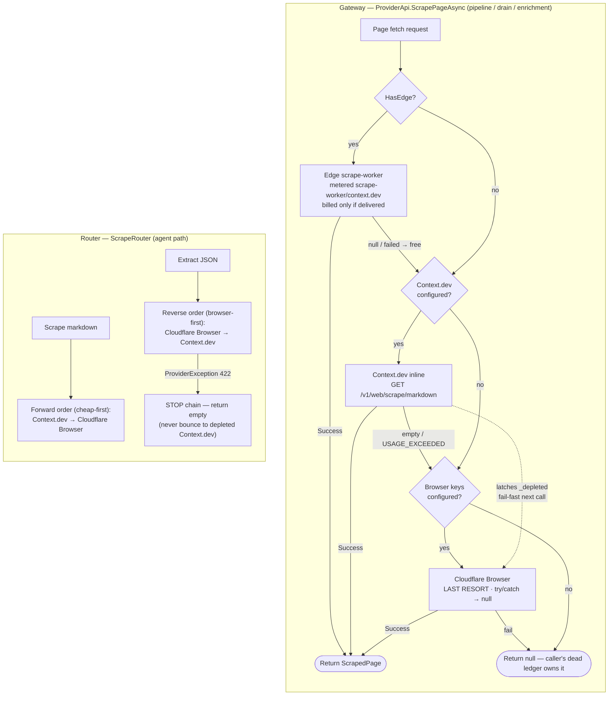

# Providers & the Scraping Layer

> How Daleel reaches the outside world for data: the provider abstraction, the metered gateway that
> every non-agent call flows through, and the FULL fallback chain for page fetches
> (Context.dev → Cloudflare Browser Rendering). Every claim here is grounded in the source — file paths
> and class/method names are cited so you can trace the exact call. When the code and this doc
> disagree, the code wins; fix the doc.

---

## 0. The shape in one paragraph

Daleel talks to four external families: **SerpAPI** (Google web/images/maps discovery), **Context.dev**
(page-to-markdown scraping + brand catalogues), **Cloudflare Browser Rendering** (headless-browser
scraping + structured store extraction), and **Google Places / Apify** (store locations + social).
Two abstractions front them. `IScrapeProvider` / `IExtractProvider` are the low-level "render a page"
and "extract JSON from a page" contracts, implemented by `ContextDevProvider` and
`CloudflareBrowserProvider` and composed by `ScrapeRouter`. Above them sits `IProviderApi` — the single
**metered gateway** every pipeline activity and background service uses instead of constructing a
provider directly, so every external call is timed, cost-estimated, and charged to the running job by
construction.

The load-bearing invariant across the whole layer (see `CLAUDE.md`): **every page-fetch path needs the
full provider fallback chain**. A Context.dev-only path dies silently for weeks the moment credits
deplete — this once killed all `enrich.verifypage` units (117 dead, 0 completed) and stripped price +
image off every crawled card.

---

## 1. Two layers: the gateway and the router

There are two distinct places a page fetch can start, and they are NOT the same object.

| Layer | Type | Where it lives | Who calls it | Chain |
|-------|------|----------------|--------------|-------|
| **Gateway** | `IProviderApi` → `ProviderApi` | `src/Daleel.Web/Services/ProviderApi.cs` | Pipeline activities + background services (drain, enrichment) — everything OUTSIDE an `AgentService` | edge scrape-worker → Context.dev inline → Cloudflare Browser |
| **Router** | `ScrapeRouter` (`IScrapeProvider` + `IExtractProvider`) | `src/Daleel.Search/ScrapeRouter.cs` | The `AgentService`'s own providers (the LLM agent path), wrapped at build time by `LoggingProviders` | Context.dev → Cloudflare Browser |

Why two: the agent's providers are wrapped with their own logging decorators at build time, so agent
calls are already metered. Every OTHER call site — the store/brand catalogue crawls, the enrichment
drain's page verifications, ad-hoc scrapes — used to each remember its own `ApiCallTimer` wrap, and the
ones that forgot leaked spend invisibly. `IProviderApi` closes that: "New provider capabilities belong
HERE, not at call sites" (`ProviderApi.cs` class remarks).

---

## 2. The gateway: `IProviderApi` / `ProviderApi`

`src/Daleel.Web/Services/ProviderApi.cs`. Registered as a singleton in `Program.cs` (~line 573) with
the edge worker client, fleet client, worker options, and R2 storage injected optionally — each is
null when unconfigured, and the gateway degrades accordingly.

### 2.1 Capability flags

The gateway advertises what is wired so callers can branch without probing:

- `HasScraper` — `CONTEXT_DEV_API_KEY` resolves (a scraping backend exists).
- `HasEdge` — the Cloudflare execution layer is registered (edge submits possible).
- `EdgeDrainReady` — the FULL edge return path exists: edge client **and** poll-queue credentials
  (`CanDrainQueue`) **and** R2 configured. A submit REPLACES inline persistence, so handing work off
  without a drain would strand results permanently — this flag gates that decision.
- `HasPlaces`, `HasSocial`, `HasEdgeExtract`, `HasEdgeClassify`, `HasEdgeFilter` — analogous per-family
  probes.

### 2.2 `ScrapePageAsync` — the full fallback chain

`ProviderApi.ScrapePageAsync(url, format, ct)` is the canonical page fetch. It walks **three tiers**,
each metered, degrading on failure or empty content:

1. **Edge scrape-worker** (`_edge.ScrapePageAsync`) when `HasEdge`. Same Context.dev vendor call, run
   from the worker (the key lives on the edge). Metered as `scrape-worker/context.dev`. Critically, the
   edge attempt is **billed only when it delivered** (`success: p => p is { Success: true }`) — a
   null/failed edge page costs nothing, so the inline fallback below is the single charge. No
   double-bill on a worker outage or bearer rotation.
2. **Context.dev inline** (`ContextDev().ScrapeAsync`) — metered as `Context.dev`. Returned when
   `page.Success`.
3. **Cloudflare Browser Rendering** (`Browser().ScrapeAsync`) — the **LAST RESORT**, built lazily from
   `CLOUDFLARE_ACCOUNT_ID` + `CLOUDFLARE_API_TOKEN`. Wrapped in try/catch that returns null (best-effort;
   the caller's retry/dead ledger owns the outcome). This is the tier whose absence killed
   `enrich.verifypage` when Context.dev depleted.

`OperationCanceledException` always rethrows — a genuine cancel must never be swallowed as "empty".

### 2.3 Catalogue and brand calls

- `ExtractCatalogAsync(domain, maxProducts, timeoutMs)` → Context.dev `/v1/brand/ai/products`
  (`catalog/extract`). `maxProducts ≤ 0` means **uncapped** (the vendor ceiling applies) — per the
  no-result-caps pipeline invariant, an explicit cap is only forwarded when a caller chose one. The
  metering `describe` reports `"{n} product(s)"`; "0 products" is the single most important thing this
  paid call can tell us.
- `GetBrandAsync(domain)` → Context.dev `/v1/brand/retrieve` (`brand/retrieve`).
- `SubmitEdgeCatalogAsync` / `SubmitEdgeBrandAsync` hand a crawl to the edge scrape-worker (see the
  Cloudflare Workers doc) — metered at submit time, and **only on an accepted handle**, with the same
  per-call estimate the inline crawl would record.

### 2.4 Provider caching

Each backing provider is cached and rebuilt only when its resolved key changes (`ContextDev()`,
`Browser()`, `Places()`, `Social()`, all under `_gate`). Rotating a key produces a fresh provider; a
stable key reuses the connection pool. The `Browser()` fallback additionally honours a test-injected
`_browserOverride`.

---

## 3. `ScrapeRouter` — the agent-path chain

`src/Daleel.Search/ScrapeRouter.cs`. The router is BOTH an `IScrapeProvider` (markdown) and an
`IExtractProvider` (schema extraction), so a caller that feature-detects `_scraper is IExtractProvider`
still sees the extraction capability through the router. (Without that dual implementation, adding a
second provider to the chain silently HID the extraction capability, and per-URL store extraction
returned nothing.)

### 3.1 Opposite chain orders — on purpose

The single most important detail of the router: **scrape and extract walk the chain in OPPOSITE
orders.**

- `ScrapeAsync` (markdown/HTML) uses **forward** order — cheap-first. Context.dev is tried before the
  heavy headless browser, falling to the next provider on a failure OR empty content.
- `ExtractAsync` (structured JSON) uses **reverse** order — browser-first
  (`chain.OfType<IExtractProvider>().Reverse()`). JS-heavy, anti-bot store/marketplace pages need the
  most capable renderer, so the Cloudflare headless browser leads and the lighter extractor is the
  fallback.

Each fallback hop is surfaced (not silent) as a `ScrapeFallback(From, To, Url, Reason)` record via the
`_onFallback` callback, so the pipeline can REPORT "browser extract empty → Context.dev" on the
timeline.

### 3.2 The 422 stop rule

Inside `ExtractAsync`, a `ProviderException { StatusCode: 422 }` does **not** fall through to the next
extractor — it returns the last (or empty) result and stops the chain. A 422 is a request-shape
rejection, not an outage: a different extractor handed the same schema can't do better, and the only
remaining fallback is the (frequently depleted) Context.dev. Bouncing there would turn a recoverable
schema reject into a guaranteed harvest failure. The `CloudflareBrowserProvider` already self-heals a
422 internally (§5.2); one escaping means even that failed.

`HasProducts` decides whether a result "carries products" — tolerant of a bare array and of every
wrapper key (`products`, `items`, `listings`, `results`) that `ListingExtractor.FromExtractedJson`
accepts, kept in lockstep so a valid result under an alternate key isn't judged empty and needlessly
re-billed.

---

## 4. `ScrapeFormat`

`src/Daleel.Search/Abstractions/IScrapeProvider.cs`:

| Value | Meaning | Provider mapping |
|-------|---------|------------------|
| `Markdown` (default) | Clean, LLM-ready markdown — what we feed the model | Context.dev `/v1/web/scrape/markdown`; CF `/browser-rendering/markdown` |
| `Html` | Raw rendered HTML | Context.dev `/v1/web/scrape/html`; CF `/browser-rendering/content` |
| `Text` | Main text, stripped of nav/ads | No dedicated endpoint — both providers fold non-HTML formats onto the markdown path |

A `ScrapedPage` carries `Url`, `Title`, `Content`, `Format`, `Provider`, `Success`, and `Error`.
`Success` is `Content.Length > 0` — an empty 200 is a **paid non-result**, which is exactly what the
metering layer flags.

---

## 5. The providers

### 5.1 `ContextDevProvider` — primary scraper + brand intelligence

`src/Daleel.Search/Providers/ContextDevProvider.cs`. Base `https://api.context.dev`, bearer
`CONTEXT_DEV_API_KEY`. Implements `IScrapeProvider` + `IExtractProvider` and exposes brand-specific
extras.

| Method | Endpoint | Notes |
|--------|----------|-------|
| `ScrapeAsync` | **GET** `/v1/web/scrape/{markdown\|html}?url=…` | Web endpoints are GET-with-query, NOT POST-with-body. POSTing returned *"API you have tried to access does not exist"*, which silently routed every scrape to the fallback. |
| `ExtractAsync` | POST `/v1/web/extract` `{ url, schema }` | Result may be under `data`/`extract`/`result` or the root. |
| `GetBrandAsync` | GET `/v1/brand/retrieve?domain=…` | Returns a `BrandProfile` (name, description, industry, logo, colors, socials). |
| `CrawlAsync` | POST `/v1/web/crawl` `{ url, limit }` | Whole-site crawl → each page's markdown. |
| `ExtractProductsAsync` | POST `/v1/brand/ai/products` | The purpose-built "scrape the models + prices a site sells" endpoint. Slow (crawls + AI-extracts) — run off the hot path with a generous timeout. `maxProducts ≤ 0` omits the field ⇒ uncapped. |

**The depletion latch.** Context.dev returns `USAGE_EXCEEDED` once the account's quota is spent — this
is EXPECTED, not a bug; the provider chain exists precisely so Cloudflare Browser takes over. The
provider latches it:

- `_depleted` is a `volatile bool`, latched the first time `NoteDepletion` sees the marker anywhere in
  a response body OR a (post-retry) error message. Monotonic (only false→true), so a plain volatile
  read suffices.
- `SendTrackedAsync` short-circuits **before any HTTP** once latched, throwing a synthetic 429 —
  *"usage quota exhausted; short-circuiting to the fallback provider."* Depletion is a run-long steady
  state; without the latch every further call is a guaranteed miss plus three wasted retry round-trips
  per page.
- `IsDepleted` exposes the state. This is what makes the fallback **fail-FAST** rather than
  fail-slow — the router drops to Cloudflare Browser instantly instead of re-hammering a dead quota.

### 5.2 `CloudflareBrowserProvider` — headless-browser fallback + store extractor

`src/Daleel.Search/Providers/CloudflareBrowserProvider.cs`. Base `https://api.cloudflare.com`, auth
requires BOTH `CLOUDFLARE_ACCOUNT_ID` (in the URL path) and a bearer `CLOUDFLARE_API_TOKEN`. Renders on
Cloudflare's edge with a real headless browser, so it gets through most anti-bot defences and JS-heavy
pages simpler fetchers can't. It is the **primary structured extractor for STORE listings** (Context.dev
stays the brand-catalogue path).

Endpoints are `/client/v4/accounts/{id}/browser-rendering/{action}`:

- `ScrapeAsync` → `/markdown` or `/content` (HTML).
- `ExtractAsync` → `/json` (the browser-native equivalent of Context.dev AI Extract).
- Also `ScreenshotAsync` (`/screenshot`) and `ExecuteScriptAsync` (`/scrape`).

Every render carries `gotoOptions.timeout = 60_000` (`NavigationTimeoutMs`). Cloudflare's default is
30s, and heavy storefronts regularly blow exactly that (code 6002 *"Navigation timeout of 30000 ms
exceeded"*), which killed the enrichment drain's `verifypage` fetches and left crawled cards
priceless/imageless. Deadline-bound callers stay fast regardless — their own 30s CTS still cancels;
only deadline-free callers (the drain) use the full window.

#### The `/json` contract gotchas

Cloudflare's `/browser-rendering/json` validates `response_format` strictly, and its accepted schema
shape has proven brittle. The rules (learned the hard way — see the "CF Browser /json endpoint
contract" project note):

1. `response_format`'s ONLY valid type is **`"json_schema"`** with a **BARE schema body**:
   `response_format = { type: "json_schema", json_schema: <schema> }` — NOT the OpenAI
   `{ name, schema }` envelope.
2. The schema must be a **non-empty JSON object**. `TryAsSchemaElement` returns false for null, a
   non-object, or an object with no properties, so the caller omits `response_format` entirely and
   drops to prompt-only extraction — sending an empty or invalidly-typed `json_schema` body itself 422s.
3. Type **`"json"` is invalid and 422s.** Only `"json_schema"` is accepted.
4. **Schema-less mode** = omit `response_format`, pass a `prompt`. Workers-AI returns freeform JSON,
   which the provider still parses.

**The 422 self-heal.** When a schema-constrained request 422s, the provider treats that as CF's signal
to drop the constraint: it retries the SAME page schema-less (with `FreeformExtractionPrompt`, biased
toward the `{ "products": [...] }` shape the store pipeline expects). This keeps the failure INSIDE the
provider — it must never escape to the router, whose only fallback is the depleted Context.dev.
Combined with the router's 422 stop rule (§3.2), a schema reject is contained end-to-end.

`ParseExtraction` unwraps Cloudflare's `{ "success": true, "result": … }` envelope; `result` is
normally the extracted object but is occasionally a JSON string that itself needs parsing. Anything
unparseable yields an empty object — never a throw.

### 5.3 `SerpApiProvider` — WEB discovery only

`src/Daleel.Search/Providers/SerpApiProvider.cs`. Base `https://serpapi.com`, key `SERPAPI_KEY`. One
key covers Google Web, Shopping, Maps, News, and Images; geo-targeting uses `gl` (country) + `hl`
(language) with an optional `location`. Every request sends `safe=active` (halal SafeSearch).

Per the external-data-source split, SerpAPI is **web-discovery only** — it finds candidate store/brand
URLs and images; it does not carry product-card extraction (that is CF Browser for stores, Context.dev
for brands). Engine mapping:

| `SearchKind` | Engine | Paginates? |
|--------------|--------|------------|
| `Web` | `google` | Yes (PageSize 10, MaxPages 10) |
| `Shopping` | `google_shopping` | Yes |
| `Maps` | `google_maps` | No |
| `News` | `google_news` | No |
| `Images` | `google_images` | No |

**`google_images` for image backfill.** `ParseImages` prefers each hit's `thumbnail` (a gstatic host,
same as Google Shopping thumbnails — renders reliably, no hotlink protection) over `original`. These
images backfill product cards during enrichment when shopping results aren't available.

**Shopping unsupported-country learning.** Google Shopping does not operate in every market. The first
HTTP 400 *"Unsupported `xx` country - gl parameter"* per country latches into `ShoppingUnsupportedGl`
(a process-lifetime concurrent set). Jordan hit this in prod: every shopping call in a search burned a
paid request and returned nothing. After the first rejection, all later shopping queries for that
market skip the call, and the product images shopping would have supplied are backfilled from
`google_images` instead.

**Edge cap awareness.** When SerpAPI is proxied through the search-worker, the worker's hourly SerpAPI
budget (a Durable Object, 1000/hr) trips into a structurally-valid *soft-empty* SERP whose
`search_metadata.status` is `"Capped"`. `IsCappedBody` detects it and stamps a `Diagnostic` string so
the router's failover event says the cap tripped rather than a generic "no results". A per-attempt
timeout (`SERPAPI_TIMEOUT_SECONDS`, default 20s, clamped 1–30s) stops a stalled call from riding
HttpClient's 100s default across all three retries before the `SearchRouter` can fail over.

---

## 6. The external-data-source split

The four families own disjoint responsibilities (memory: "external data source re-split", PR #39):

```
WEB discovery        → SerpAPI              (SERPAPI_KEY; google + google_images; 20 results/query; 1000/hr edge cap)
STORE extraction     → Cloudflare Browser   (CLOUDFLARE_* ; /browser-rendering/json; primary IExtractProvider)
BRAND catalogues     → Context.dev          (CONTEXT_DEV_API_KEY; /v1/brand/ai/products; UNCAPPED)
STORE locations      → Google Places        (GOOGLE_PLACES_API_KEY, or search-worker proxy)
SOCIAL posts         → Apify                (APIFY_TOKEN)
```

Google Shopping was dropped as a product-card source (the Deals surface is untouched). Store extraction
routes browser-first; brand catalogues are uncapped like stores; the per-job cost cap is a soft
restraint, not a fan-out limit.

---

## 7. Metering & observability

Every gateway call is metered by construction. Two pieces make that automatic.

### 7.1 `ApiCallTimer`

`src/Daleel.Core/Observability/ApiCallTimer.cs`. `TimeAsync` wraps a call and emits an `ApiCall`
record to the observer **always — even when the call throws** (try/finally + stopwatch). It:

- Classifies the outcome: `Success`, `Timeout` (on `OperationCanceledException`), or `Error`.
- Optionally measures `bytes` (response size) and `describe`s what the call returned (e.g. "0
  products") — only for a delivered result, and truncated, so the efficiency view shows what each paid
  call produced without ever storing a raw body.
- Applies the `success` predicate: a **non-throwing call the predicate judges undelivered** (e.g. an
  edge worker that returns `Success == false` rather than throwing) is downgraded to `Error` at **ZERO
  cost**. This is what makes a failed-edge-then-inline-fallback bill **once**, not twice.
- Estimates cost via `CostEstimator.EstimateCall(provider, endpoint)` only for a delivered result.

### 7.2 `AmbientApiObserver`

`src/Daleel.Core/Observability/AmbientApiObserver.cs`. An `AsyncLocal` carrier for the CURRENT job's
observer + estimator. `AgentFactory` wires the observer into the agent's own clients, but DI-resolved
components (the vision matcher, the catalogue crawls) make paid calls on their own HTTP clients and
would otherwise bypass metering entirely. Those call sites now read the ambient observer.

`AsyncLocal` flows down through awaits, `Task.WhenAll` fan-outs, and DI-scope creation on the same async
flow, so **one `Begin` at the top of a run covers every paid call underneath it** — including
sub-workflow children — with no plumbing through signatures. Parallel jobs are separate async flows, so
their scopes never bleed. An empty ambient (tests, admin tools, startup) simply means "unmetered
context": `ApiCallTimer` no-ops on a null observer.

`ProviderApi.MeterAsync` funnels every gateway call through `ApiCallTimer.TimeAsync` with
`AmbientApiObserver.Observer` / `.Estimator`. Edge submits are metered inline at submit time
(`AmbientApiObserver.Observer.Record(new ApiCall { … })`) with the same estimate an inline crawl would
record, so edge and inline work hit the cost cap and usage log identically and nothing double-counts.

### 7.3 Cost estimation keys

`src/Daleel.Core/Observability/CostEstimator.cs` prices by provider/endpoint string:

- `cloudflare/drain` → `PerEdgeDrain` (the queue lease/ack + R2 read of a drained result).
- `workers-ai/*` → `PerWorkersAi`.
- Names containing `places` / `apify` / `cloudflare`/`render` map to the matching vendor rate; a
  `scrape-worker/…` name keeps the vendor rate and adds the `edge_request` hop on top, so the usage log
  shows the route while user credits still match a direct call.

---

## 8. The fallback chain, end to end



Both paths converge on the same rule: try the appropriate provider, and when it fails or comes up empty,
fall over — never let a single depleted vendor blank the grid.

---

## 9. Key files

| File | Role |
|------|------|
| `src/Daleel.Web/Services/ProviderApi.cs` | `IProviderApi` — THE metered gateway; three-tier `ScrapePageAsync`, catalogue/brand calls, edge submits, provider caching |
| `src/Daleel.Search/ScrapeRouter.cs` | `IScrapeProvider` + `IExtractProvider` chain; forward-scrape / reverse-extract orders; 422 stop rule; `ScrapeFallback` reporting |
| `src/Daleel.Search/Abstractions/IScrapeProvider.cs` | `ScrapeFormat` (Markdown/Html/Text), `ScrapedPage`, `IScrapeProvider` |
| `src/Daleel.Search/Providers/ContextDevProvider.cs` | Primary scraper + brand intelligence; GET web endpoints; `/v1/brand/ai/products`; `USAGE_EXCEEDED` depletion latch |
| `src/Daleel.Search/Providers/CloudflareBrowserProvider.cs` | Headless-browser fallback + store `/json` extractor; 60s nav timeout; the `json_schema` contract + 422 self-heal |
| `src/Daleel.Search/Providers/SerpApiProvider.cs` | WEB discovery; `google_images` backfill; shopping unsupported-country learning; edge-cap soft-empty |
| `src/Daleel.Core/Observability/ApiCallTimer.cs` | Times/classifies/costs every call; zero-cost undelivered downgrade |
| `src/Daleel.Core/Observability/AmbientApiObserver.cs` | `AsyncLocal` per-job observer that flows through the whole run |
| `src/Daleel.Core/Observability/CostEstimator.cs` | Provider/endpoint → cost, incl. edge-hop and drain pricing |
| `src/Daleel.Web/Program.cs` (~573) | Wires `ProviderApi` singleton with edge/fleet/R2 dependencies |

See also the **Cloudflare Workers** doc for the edge execution layer these providers submit to.
