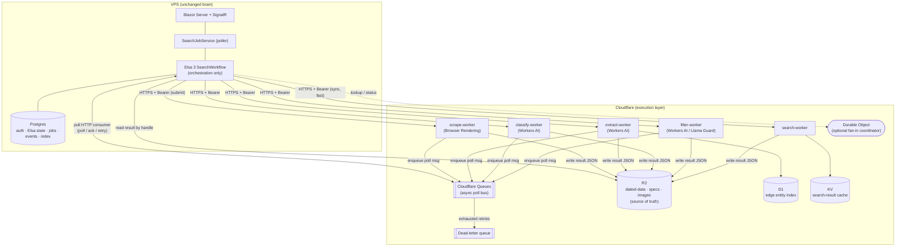
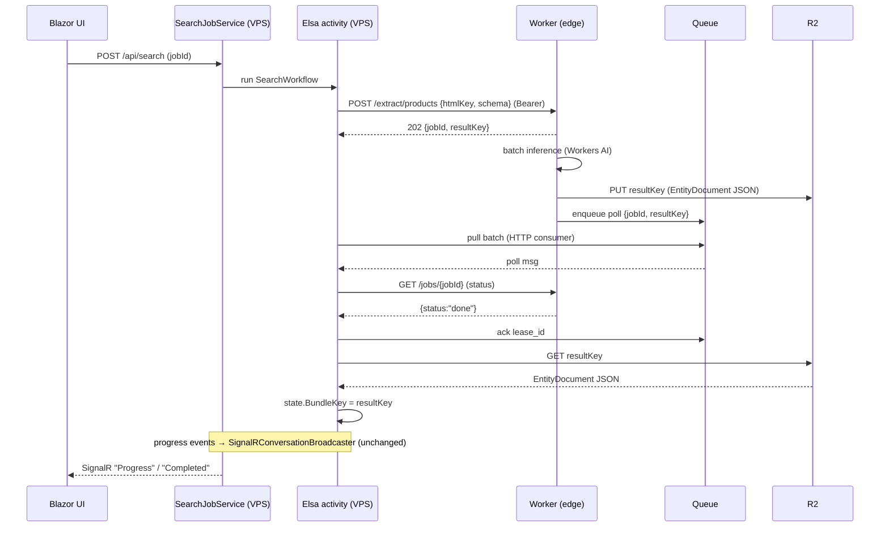

# Migrating the Search Pipeline to Cloudflare Workers (Elsa stays the orchestrator)

**Status:** Proposed
**Date:** 2026-07-04
**Author:** Architecture working doc
**Deciders:** Backend/platform owners
**Scope:** How Daleel's search pipeline execution moves from inline .NET work inside Elsa activities to HTTP-invoked Cloudflare Workers, while the Elsa workflow on the VPS remains the orchestrator.

> **One-paragraph summary.** Today every step of the search pipeline runs *inline* inside an in-process Elsa 3 workflow on the VPS: the same .NET process makes every scrape call (Context.dev), every LLM call (OpenRouter/Claude), extracts products, filters for halal compliance, and writes to R2/Postgres — all bounded by one box, which is why the fan-out is capped at `5 concurrent`. This document proposes keeping Elsa as the brain — it still decides *what* to do, branches, fans out, and sequences — but **moving each tool call into a Cloudflare Worker** that Elsa invokes over HTTPS. This is deliberately **not a vendor migration**. It is two independent changes: **(A) the execution host** — *whatever* a step calls today keeps being called, but now from inside a worker, so calls run **async, queue-backed, and massively parallel with the per-run caps removed**; and **(B) the tool/backend** — for each job, use the *right tool*, chosen on merit (keep Context.dev where it's best at brand+catalogue scraping; use Cloudflare Browser Rendering for searching/rendering arbitrary sites; use Workers AI for cheap high-volume inference; keep Claude for planning). Long-running calls use an async **submit → poll** pattern backed by Cloudflare Queues; results land in **R2** (already the source of truth) and Elsa reads them by handle. Postgres, Blazor, SignalR, auth, and Elsa itself stay on the VPS. The migration is a **strangler-fig** built on the existing `ScrapeRouter`/`IScrapeProvider` seam that already selects a backend per request — so it's swap-the-host-then-optimize-the-tool, never a big-bang cutover.

---

## Table of contents

1. [Current architecture (monolith on the VPS)](#1-current-architecture-monolith-on-the-vps)
2. [Target architecture (Elsa orchestrator + Cloudflare Workers)](#2-target-architecture-elsa-orchestrator--cloudflare-workers)
3. [Worker definitions](#3-worker-definitions)
4. [Message & queue design](#4-message--queue-design)
5. [Data flow: workers → R2 → Elsa → UI](#5-data-flow-workers--r2--elsa--ui)
6. [Migration path (phased)](#6-migration-path-phased)
7. [What stays on the VPS](#7-what-stays-on-the-vps)
8. [Cost & scaling considerations](#8-cost--scaling-considerations)
9. [Cloudflare configuration (wrangler, bindings, secrets)](#9-cloudflare-configuration-wrangler-bindings-secrets)
10. [Key design decisions (options & trade-offs)](#10-key-design-decisions-options--trade-offs)
11. [Risks, open questions & verification checklist](#11-risks-open-questions--verification-checklist)

A note on the numbers: every Cloudflare limit/price cited here was verified against the live Cloudflare docs on **2026-07-04**. Cloudflare ships changes weekly; treat anything marked **⚠︎ verify** as needing a re-check before you rely on it, and re-verify the whole table at cutover time. Doc links are collected in [§8](#8-cost--scaling-considerations) and inline.

---

## 1. Current architecture (monolith on the VPS)

Everything runs in one .NET 8 Blazor Server process (`Daleel.Web`) on the VPS. A user's search becomes a background job, which drives an **in-process Elsa 3 workflow** whose activities do the real work inline.

### 1.1 Request → job → workflow → UI (today)

```
Browser ──POST /api/search──▶ ConversationEndpoints ──▶ ConversationService.SubmitAsync
                                                              │ creates SearchJob(status="queued") in Postgres
                                                              ▼ returns 202 + jobId
                                    ┌─────────────────────────────────────────────┐
                                    │ SearchJobService (BackgroundService)        │
                                    │  polls SearchJobs every 2s                   │
                                    │  SELECT … FOR UPDATE SKIP LOCKED             │
                                    └───────────────┬─────────────────────────────┘
                                                    ▼ claims job → status="running"
                                    WorkflowSearchRunner.RunAsync  (registered ISearchRunner)
                                      builds agent from server keys, seeds scoped
                                      SearchPipelineState + HalalModerator, runs Elsa
                                                    ▼
                                    IWorkflowRunner.ExecuteAsync(SearchWorkflow)
                                                    │  activities record events → EventStoreDbContext (Postgres)
                                                    │  progress → SignalRConversationBroadcaster
                                                    ▼
                          SignalR "Progress"/"Completed" ──▶ ConversationHub ──▶ Blazor UI (Home.razor)
```

Key types (file paths relative to `src/`):

| Concern | Type | Location |
|---|---|---|
| HTTP entry | `ConversationEndpoints`, `ConversationService` | `Daleel.Web/Conversation/` |
| Job queue (DB-backed) | `SearchJobService` (BackgroundService), `SearchJob` | `Daleel.Web/Conversation/`, `Daleel.Web/Data/SearchJob.cs` |
| Runner | `WorkflowSearchRunner : ISearchRunner` | `Daleel.Web/Conversation/` |
| Workflow | `SearchWorkflow` + `SearchActivities` | `Daleel.Web/Pipeline/` |
| Shared state | `SearchPipelineState` (scoped), `CancellableActivity` (base) | `Daleel.Web/Pipeline/` |
| Real-time | `ConversationHub`, `SignalRConversationBroadcaster` | `Daleel.Web/Conversation/` |

### 1.2 The Elsa workflow (12 activities + 3 fan-out sub-workflows)

`SearchWorkflow` is a **deliberately flat `Sequence`** of `CodeActivity` steps that self-skip via `if (state.FromCache) return;` guards rather than declarative Elsa branching — chosen so control flow stays readable and testable while Elsa provides registration, sequencing, cancellation, and per-step telemetry. Heavy domain objects are carried in a **scoped `SearchPipelineState`**, *not* round-tripped through Elsa's serialized `WorkflowState`; activities resolve the same scoped instance via `context.GetRequiredService<T>()`. This contract is locked by `ElsaStateFlowTests`.

```
 1. ParseQueryActivity            normalize query, resolve geo, LLM planning → SearchStrategy
 2. CheckCacheActivity            replay a cached report (short-circuits 3–12)
 3. AnalyzeMarketActivity         LLM category analysis → SearchIntelligence (product type, store types, brands, spec schema)
 4. GatherSourcesActivity         fan out to providers (web / shopping / places / social / scrape) + halal moderation
 5. ExtractProductsActivity       LLM analyst summary + structured product projection
 6. DispatchBrandWorkflowsActivity ── fan out ≤15 × BrandResearchWorkflow  (5 concurrent, 30s/entity)
 7. DispatchStoreWorkflowsActivity ── fan out ≤10 × StoreResearchWorkflow
 8. DispatchItemWorkflowsActivity  ── fan out ≤20 × ItemDeepDiveWorkflow
 9. AggregateResultsActivity      assemble ranked AgentAnswer + counts
10. ModerateContentActivity       record halal-filter audit outcome
11. CacheResultsActivity          serialize + persist report (skips on empty)
12. ReturnResultsActivity         finalize
```

The three **sub-workflows** (dispatched via `SubWorkflowDispatcher.RunManyAsync<T>()`, 5 concurrent / 30s per entity) are where the pipeline already fans out:

- **BrandResearchWorkflow** — `SearchBrandSite → ScrapeBrandCatalog → SynthesizeBrandProfile → SaveBrandProfile → DownloadBrandImages`
- **StoreResearchWorkflow** — `ScrapeStoreSite → VerifyOnMaps → ExtractContactInfo → SaveStoreProfile → ScrapePrices`
- **ItemDeepDiveWorkflow** — `ScrapeProductPages → ExtractSpecs → ComparePrices → CollectReviews → IdentifyProduct → SaveItemProfile`

### 1.3 Where the *work* happens inline (the migration targets)

These are the compute/latency-heavy operations currently executing synchronously in the .NET process. Each is a candidate to move behind an HTTP call to a Worker:

Every row keeps its **backend choice open** (right column shows the *host* + candidate backends per the [matrix](#the-tool-for-the-job-matrix-evaluate-per-case-validate-by-shadow-compare)); the constant is that the call moves into a worker for async + parallelism.

| Inline work today | Class / method | Host worker (candidate backends) |
|---|---|---|
| Web/product scraping | `ContextDevProvider` + `ScrapeRouter` (`IScrapeProvider`/`IExtractProvider`) | **scrape-worker** (Context.dev *kept* for brand/catalogue · Browser Rendering for site-search/generic · Firecrawl fallback) |
| Query planning, category analysis, analyst summary, structured extraction | `AgentService.PlanAsync / AnalyzeCategoryAsync / AnalyzeAsync / BuildProductSearchResultAsync` via `ILlmClient` (`OpenRouterClient` default, `AnthropicClient` fallback) | **extract-worker** / **classify-worker** (Workers AI for commodity; **Claude/OpenRouter kept** for planning + nuanced analysis) |
| Halal moderation (whitelist → keyword → LLM → vision) | `HalalModerator.ModerateAsync<T>()`, `LlmHalalClassifier`, `OpenRouterImageHalalClassifier` | **filter-worker** (Workers AI Llama-Guard/vision · OpenRouter kept as fallback) — *policy stays on VPS* |
| Multi-provider gather (web/shopping/places/social) | `AgentService.GatherAsync()` | **search-worker** (external search/shopping/places APIs · Browser Rendering for site render) |
| Entity persistence | `SearchEntityStore.SaveAllAsync()` → R2 (`R2StorageService.StoreJsonAsync`) + Postgres `EntityRecord` index | R2 write from worker + **D1** edge index mirror |
| Image re-host | `R2StorageService.StoreImageAsync` | inside scrape/brand workers |

### 1.4 Data & storage split (today)

- **R2** (`R2StorageService`, S3-compatible via `Amazon.S3`): three logical buckets — **Specs** (canonical merged spec sheets), **Data** (raw scraped + `EntityDocument` JSON, the *source of truth*), **Images** (re-hosted). Per the entity-storage design, R2 holds the rich self-contained JSON; Postgres holds only a thin index + relations.
- **Postgres** (`DaleelDbContext`, resolved via `PostgresConnection.ResolveAppDatabase()`): auth (`IdentityDbContext`), `SearchJobs`, `SearchCache`, `EntityRecord` (index → R2 key), `Brand`/`Store`/`ProductProfile`, moderation tables (`ModerationWhitelistEntry`, `ModerationRuleOverride`, `FilteredContentLogs`), plus a separate **Elsa** DB and a dedicated `EventStoreDbContext` (pipeline audit). SQLite remains a dev/fallback path.
- **Cross-environment note:** QA (`167.233.198.210`) and prod are separate boxes with per-box SQL, but **R2 buckets are shared**. Any new edge store (D1, KV) must be provisioned/isolated per environment the same way — see [§9.5](#95-environments-qa-vs-prod).

### 1.5 What's wrong with inline (why migrate at all)

- **The VPS is the ceiling.** Scraping and LLM calls hold .NET threads and memory on one box; concurrency is bounded by the VPS, not the workload. The fan-out is already capped (`5 concurrent`, `≤15/10/20 entities`) partly to protect the box.
- **Scraping is brittle & self-hosted.** Context.dev is an external dependency with its own failure modes (the "empty vs faulted run" ambiguity is a recurring incident class).
- **Everything competes for the same process.** A heavy extraction run degrades the Blazor UI thread pool on the same host.
- **Egress & latency.** Scraping/LLM traffic egresses from a single region; the edge is closer to both target sites and R2.

Moving *execution* to the edge lets Elsa stay small and authoritative while work scales horizontally and independently.

---

## 2. Target architecture (Elsa orchestrator + Cloudflare Workers)

**Principle:** *Elsa is the brain; Workers are the hands.* The workflow shape, branching, caps, and sequencing are unchanged. What changes is that an activity's body becomes "call a Worker and read the result from R2" instead of "do the work in-process."



### 2.1 Two invocation modes

Every activity picks one of two shapes, decided by *how long the underlying call takes*:

**A. Synchronous (fast, < a few seconds of CPU).** Elsa `POST`s to the Worker, the Worker does the work and returns the result (or a small R2 handle) in the HTTP response. Good for: cache lookups, a single short classification, a `/scrape` of one already-rendered page.

**B. Asynchronous (submit → poll).** Elsa `POST`s a job; the Worker returns `202 {jobId, resultKey}` immediately and processes in the background (via Queues / `waitUntil` / a batch call). Elsa enqueues a **poll message**; a queue consumer checks the upstream result, writes it to R2, and acks. Elsa polls the queue (pull HTTP consumer) or the R2 key until the result is present, then reads it. Good for: full catalogue crawls, multi-page deep-dives, Workers-AI batch inference, any call that can exceed ~30s.

> **Why the async pattern is mandatory for long calls — and why it's cheap.** Cloudflare Workers bill **CPU time, not wall-clock time**; a Worker blocked on a 3-minute LLM/scrape call but using ~50 ms of CPU is billed for ~50 ms. But you still *cannot safely hold an HTTP request open for minutes*: the client (Elsa) can disconnect, the runtime restarts a few times/week (30 s grace, then terminate), and `waitUntil()` only extends execution **30 s** after the response. So long work must be *submitted*, not *held* — and because the idle wait is nearly free, offloading it costs almost nothing. This is the single most important shape in the design. (Sources: [Workers limits](https://developers.cloudflare.com/workers/platform/limits/), [waitUntil](https://developers.cloudflare.com/workers/runtime-apis/context/).)

### 2.2 The activity contract change (the real work of the migration)

Today an activity shares heavy objects through scoped DI:

```csharp
// today: work happens inline, state shared in-process
var bundle = state.Agent.GatherAsync(strategy);      // holds a thread, lives in RAM
state.Bundle = bundle;                                // next activity reads it from the same scoped object
```

After migration, the shared object becomes an **R2 handle** (a key), and the activity's job is orchestration + handle-passing:

```csharp
// after: work happens in a worker, state referenced by handle
var handle = await _cf.SubmitAsync(WorkerKind.Search, new { strategy, market });  // returns { jobId, resultKey }
await _cf.AwaitResultAsync(handle);                   // poll queue / R2 until ready (non-blocking-ish)
state.BundleKey = handle.ResultKey;                   // pass the R2 key downstream, not the payload
```

`SearchPipelineState` shrinks from *carrying payloads* to *carrying R2 keys* (plus small counters and the final answer). This is deliberate: it keeps Elsa's memory footprint flat regardless of result size, and it means a restarted workflow can re-read any intermediate result from R2 rather than recomputing it. **`ElsaStateFlowTests` must be updated to assert handle-passing rather than payload-passing** — that test is the migration's tripwire.

### 2.3 The five Workers at a glance

Each host routes to a backend per the [matrix](#the-tool-for-the-job-matrix-evaluate-per-case-validate-by-shadow-compare); the "backends" column lists candidates, not a mandated swap.

| Worker (host) | Input → Output | Backends (chosen per job) | Mode |
|---|---|---|---|
| **scrape-worker** | URL/site → structured/markdown/HTML | Browser Rendering · **Context.dev (kept)** · Firecrawl | async for crawls, sync for single page |
| **classify-worker** | text/images → labels + confidence | Workers AI (Llama/Mistral; vision) · OpenRouter | sync (small) / batch (bulk) |
| **extract-worker** | raw HTML → structured product JSON | Workers AI (JSON mode) · Browser Rendering `/json` · Claude for hard cases · + R2 + D1 | async |
| **filter-worker** | content → halal findings | Workers AI (Llama-Guard + vision) · OpenRouter | sync per batch |
| **search-worker** | query → search results | external search/shopping/places APIs · Browser Rendering · + KV cache | sync (async if provider is slow) |

Details in [§3](#3-worker-definitions).

---

## 3. Worker definitions

Each Worker is a small ES module exporting `default { async fetch(request, env, ctx) }`, deployed independently, secured with the **house auth pattern** already used by `workers/log-viewer` (see [§9.2](#92-the-house-auth-pattern-reuse-verbatim)). All accept JSON, all fail closed on a missing secret, all return either an inline result or a `{ jobId, resultKey }` handle.

### 3.0 Workers are execution hosts, not vendor replacements

A worker below is named for a **capability** (scrape, classify, extract, filter, search), **not** for a vendor. Two decisions are made separately for every job:

- **Execution host — always a Worker.** Moving the call off the VM into a worker is the constant win, *independent of which backend it calls*: **async execution, queue-backed decoupling, and horizontal parallelism with the current caps (`5 concurrent`, `≤15/10/20 entities`) removed**. Those caps exist today only because everything shares one VM's threads and memory; on the edge, hundreds of jobs run at once.
- **Backend/tool — the right tool for the job.** Inside a worker, the actual call routes to whichever backend is best for *that* job — which may be the **current vendor kept unchanged**. Daleel already has the seam for this: `ScrapeRouter` + `IScrapeProvider`/`IExtractProvider` already pick a provider per request. The migration hosts that router inside a worker and **widens the backend set** (adds Browser Rendering, Workers AI) rather than replacing it.

So `scrape-worker` is not "the Browser Rendering worker" — it's "the scraping execution host," and a single request may dispatch to Context.dev *or* Browser Rendering *or* Firecrawl depending on the job. Retiring a vendor is never a goal; keeping Context.dev where it wins, *inside a worker*, still delivers the async + parallelism + no-caps win.

#### The tool-for-the-job matrix (evaluate per case; validate by shadow-compare)

All jobs run **inside workers** (async / queued / parallel). The only question below is *which backend the worker calls*. Recommendations are **hypotheses to validate** — the worker interface makes A/B cheap: run both backends, diff outputs, keep the winner (the existing `ScrapeRouter` shadow-mode pattern).

| Pipeline job | Best-fit backend (hypothesis) | Why | Runner-up / fallback |
|---|---|---|---|
| Web/site **search & discovery** | External search API + **Browser Rendering** | search API for the SERP; Browser Rendering renders/scrapes arbitrary JS sites — the *"searching sites"* case | Context.dev scrape |
| Shopping / product SERP | External shopping API | structured shopping results | Browser Rendering on retailer search |
| Places / store locations (`VerifyOnMaps`) | Maps/Places API | authoritative geo + contact data | Browser Rendering |
| Generic JS-heavy page render | **Browser Rendering** | full Chromium; `/markdown`, `/scrape` by selector; handles SPAs | Context.dev / Firecrawl |
| **Brand → catalogue → products** (structured) | **Context.dev** | purpose-built brand intelligence + catalogue crawl (`GetBrandAsync`/`CrawlAsync`) returns structured brand+product | Browser Rendering `/json` + extract |
| Product detail / spec pages | *evaluate:* Context.dev vs Browser Rendering `/json` | site-structure-dependent | the other |
| Price scraping | **Browser Rendering** `/scrape` (CSS selectors) | precise element extraction | Context.dev |
| **Query planning** (strategy) | **Claude** (via OpenRouter) | complex reasoning, quality-critical | keep |
| Category / market analysis | Claude/OpenRouter *or* Workers AI 70B | reasoning; cost/quality trade-off — evaluate | the other |
| Structured extraction from HTML | **Workers AI** (JSON mode) | commodity, high-volume, cheap, parallel | Browser Rendering `/json` (folds scrape+extract) |
| Classification (labels, buy-intent) | **Workers AI** (3B/8B) | cheap, fast, massively parallel | OpenRouter |
| Halal **text** moderation | **Workers AI** Llama-Guard + halal prompt | cheap signal feeding `HalalModerator` (VPS keeps policy) | OpenRouter (current) |
| Halal **image** moderation | **Workers AI** vision | cheap parallel vision | OpenRouter vision (current) |

Read the per-worker sections below as **the execution host + its default backend**, with the matrix as the routing policy each host applies.

A shared response envelope keeps Elsa's client simple:

```jsonc
// synchronous success
{ "ok": true, "mode": "sync", "result": { /* payload */ }, "resultKey": "data/<...>.json", "meta": { "ms": 812, "cost": {"neurons": 1240} } }
// async accepted
{ "ok": true, "mode": "async", "jobId": "job_01H…", "resultKey": "data/<...>.json", "poll": { "queue": "poll-results", "after": 5 } }
// error (never silently empty — mirrors Daleel's "faulted ≠ empty" rule)
{ "ok": false, "error": { "code": "SCRAPE_TIMEOUT", "message": "…", "retryable": true } }
```

### 3.1 scrape-worker — URL/site → structured data (scraping execution host)

**Hosts:** the scraping capability today spread across `ContextDevProvider` + `ScrapeRouter` (`IScrapeProvider`/`IExtractProvider`). The worker **is the `ScrapeRouter`, relocated to the edge** — it picks a backend per request per the [matrix](#the-tool-for-the-job-matrix-evaluate-per-case-validate-by-shadow-compare): **Browser Rendering** for site search / generic JS pages / price selectors; **Context.dev** for brand-intelligence + catalogue → product scraping; Firecrawl as fallback. The `backend` is a request parameter (or inferred from the job kind), so Context.dev calls simply move *inside the worker* unchanged — the win is async + parallelism, not a vendor swap.

One backend it adds — **Cloudflare Browser Rendering** (rebranded **"Browser Run"** 2026-04-15; REST path segment and permission remain `browser-rendering`) — is worth detailing since it's new to the stack. Two access modes:

- **REST Quick Actions** (duration-billed only, no concurrency charge): `POST …/browser-rendering/markdown` (LLM-ready page text), `/content` (rendered HTML), `/scrape` (CSS-selector element extraction with text/attributes/geometry), `/links`, and `/crawl` (whole-site from one seed). This is the closest drop-in for Context.dev's "URL in → markdown/HTML out" shape.
- **Worker `browser` binding** (`env.BROWSER.quickAction("json", …)` or Puppeteer/Playwright): needed only when you want session reuse across many pages; billed on **duration + concurrency** ($2/extra concurrent browser).

**Endpoints:**

```
POST /scrape/page      { url, format, backend?: "browser"|"contextdev"|"firecrawl", waitUntil?, waitForSelector? }
                       → sync { ok, result: { url, title, content, format }, backendUsed, resultKey }
POST /scrape/elements  { url, selectors: [".price", "h1", …], backend? }  → sync { elements: [...] }
POST /scrape/brand     { brandUrl, withCatalog: true, backend?: "contextdev" }  → async { jobId, resultKey }  (default Context.dev)
POST /scrape/catalog   { seedUrl, maxPages, backend? }           → async { jobId, resultKey }  (Browser Rendering /crawl or Context.dev)
```

`backend` is optional — when omitted the worker applies the matrix default for the endpoint (`/scrape/brand` → Context.dev, `/scrape/catalog`/`/scrape/page` → Browser Rendering). `backendUsed` is echoed back for observability and shadow-compare.

**Notes & gotchas that shape the contract:**
- **JS-heavy pages/SPAs:** default wait is `domcontentloaded` (fires *before* JS renders), so `/markdown` etc. can return empty/partial content. The worker must default `gotoOptions.waitUntil = "networkidle2"` (or accept a `waitForSelector`). This is exactly Daleel's own "empty vs faulted" trap — surface it as an explicit error, never a silent empty.
- **`422 Unprocessable Entity`** almost always means a timeout or the target crashed — map it to `{ ok:false, code:"SCRAPE_TIMEOUT", retryable:true }`.
- **Page-load timeout maxes at 60 s**; action timeout up to 5 min. Catalogue crawls therefore *must* be async.
- **Session reuse** (`browser.disconnect()` + `connect(sessionId)`) cuts cold starts and the 1-browser/sec creation limit — worth it only on the binding path for multi-page deep-dives.
- **`/crawl` on Free is capped** (5 crawls/day, 100 pages) — production crawling needs Workers Paid.
- Every Quick Action response includes an `X-Browser-Ms-Used` header → feed it into Daleel's existing cost tracking (`JobApiCallCollector`).

**Consolidation opportunity:** the REST **`/json` endpoint** does LLM-driven extraction against a JSON Schema *inside the scrape call* (billed on Workers AI separately). For simple product pages, scrape-worker's `/json` can **replace a separate extract-worker call**, collapsing two hops into one. Keep them separate for complex pages where extraction needs the full `AgentService` prompt logic.

### 3.2 classify-worker — text/images → labels + confidence

**Replaces:** the commodity classification currently done by LLM calls (buy-intent heuristics, category tagging, the keyword/LLM adjudication *signal* inside moderation) — **not** the strategy planning, which stays on Claude/OpenRouter.

**Cloudflare Workers AI**, called via `env.AI.run("@cf/…", input)`:

| Job | Suggested model | Why |
|---|---|---|
| High-volume label + confidence | `@cf/meta/llama-3.2-3b-instruct` (80k ctx) or `@cf/meta/llama-3.1-8b-instruct-fp8` (32k ctx) | cheap, fast, JSON-capable |
| Higher-quality classification | `@cf/meta/llama-3.3-70b-instruct-fp8-fast` (24k ctx) | best quality; function calling + batch |
| Long inputs | `@cf/meta/llama-4-scout-17b-16e-instruct` (131k ctx) | when the text won't fit smaller windows |
| Image classification | `@cf/microsoft/resnet-50` / `@cf/meta/llama-3.2-11b-vision-instruct` | pure label vs. reasoned vision |

**Structured output:** use JSON mode so there's no brittle text parsing — OpenAI-compatible path takes `response_format: { type: "json_schema", schema }`; native `@cf/` models take `guided_json`. (Which field works depends on the model — check its input schema.)

```
POST /classify/text   { items: [{id, text}], schema, model? }  → { verdicts: [{id, label, confidence, reason}] }
POST /classify/images { urls: [...], model? }                   → { verdicts: [{url, label, confidence}] }
```

**Gotchas:** only **one AI binding per Worker**; `llama-3.2-11b-vision-instruct` needs a one-time `{"prompt":"agree"}` license call; Workers AI **bills even in `wrangler dev`** (no local mock); 70B models burn neurons ~8× faster than 8B/3B, so exhaust the 10k free neurons/day almost immediately — prototype on small models. For non-real-time bulk classification, use the **async Batch API** (`queueRequest:true`, results typically ≤5 min) to get past per-model sync rate limits.

### 3.3 extract-worker — raw HTML → structured product JSON

**Replaces:** `AgentService.BuildProductSearchResultAsync` / `ExtractProductsActivity` structured projection, and `ItemDeepDiveWorkflow`'s `ExtractSpecs`.

Takes raw HTML/markdown (from scrape-worker or an R2 key) and emits Daleel's product/spec JSON shape. **Workers AI in JSON mode**, schema-forced, model chosen by input length:

- default `@cf/meta/llama-3.3-70b-instruct-fp8-fast` (best quality, 24k ctx);
- `@cf/meta/llama-4-scout-17b-16e-instruct` (131k ctx) or **chunking** for long catalogue pages;
- `@cf/mistralai/mistral-small-3.1-24b-instruct` (24B, `guided_json`) as a mid-tier.

```
POST /extract/products { htmlKey?|html, schema, market, intent }  → async { jobId, resultKey }
```

**Mode: async.** Extraction of a full page set is multi-second-to-minutes; return `202` and process via Queue/batch. On completion the worker:
1. writes the `EntityDocument` JSON to **R2 `daleel-data`** (source of truth) — same keying as `SearchEntityStore` today (`{brand}/{model}/{intent}.json`);
2. upserts a thin index row into **D1** (id, type, name, slug, market, brandId/storeId, r2Key) — the edge mirror of Postgres `EntityRecord`;
3. returns the R2 key as the handle.

**Why D1 here:** the edge index lets a *later* worker (or a fast repeat search) resolve "do we already have this brand/product?" without a round-trip to the VPS Postgres. Keep D1 rows **thin** (IDs/names/keys) — the rich JSON stays in R2. D1 bills on **rows read**, so full scans are expensive; index every filter column (`type`, `market`, `slug`) and always `LIMIT`. Writes are single-primary, so treat D1 as a **read-optimized projection** updated by the pipeline, with Postgres still authoritative. Use the **Sessions API** (`env.DB.withSession(bookmark)`) for read-your-writes when it matters.

**Long-HTML gotcha:** the popular 70B fp8-fast model is only **24k tokens** — long product pages need Scout (131k) or chunk-and-merge (mirrors `MergeAndCleanSpecsActivity`).

### 3.4 filter-worker — content → halal findings

**Replaces:** the LLM and vision *layers* of `HalalModerator` (`LlmHalalClassifier`, `OpenRouterImageHalalClassifier`). **Keep the whitelist and keyword layers, and all policy/veto logic, on the VPS** — they read admin-tuned Postgres tables (`ModerationWhitelistEntry`, `ModerationRuleOverride`) and encode the invariants that must not drift (fail-open, riba never filtered, show-by-default ≥ 0.8, haram-wins dedupe, image-strip ≠ removal, Arabic word-boundary matching). The worker is a *stateless classifier the VPS calls*, not the moderation authority.

**Workers AI:**
- Text: `@cf/meta/llama-guard-3-8b` — a purpose-built safety classifier (131k ctx, very cheap output) that emits safe/unsafe + violated categories. **Caveat:** its categories are *generic safety*, not halal-specific — treat its output as **one signal feeding Daleel's existing `HalalModerator`**, not a replacement for the halal keyword/policy logic. Optionally also run a Llama instruct model with the existing halal prompt for the nuanced cases.
- Vision (image screening): `@cf/meta/llama-3.2-11b-vision-instruct` or `@cf/llava-hf/llava-1.5-7b-hf`.

```
POST /filter/text   { items:[{id, text, sourceUrl}], policy }  → { findings:[{id, category, confidence, reason, source:"llm"}] }
POST /filter/images { urls:[...], policy }                      → { findings:[{url, category, confidence, source:"vision"}] }
```

**Mode: sync per batch** (moderation is on the critical path before results are shown; a batch of flagged items is small). The VPS `HalalModerator` calls the worker for the LLM/vision layers, then applies thresholds, whitelist, dedupe, and audit-logging exactly as today. This preserves the **fail-open** invariant: if the worker errors or times out, the VPS treats it as "no new finding" and shows content, never blocks the pipeline.

### 3.5 search-worker — query → search results (external search APIs)

**Replaces:** the provider gather in `AgentService.GatherAsync()` (web/shopping/places/social) — i.e. the parts of `GatherSourcesActivity` that hit external search APIs.

A thin fan-out over external search/shopping/places APIs, fronted by a **KV cache** keyed on the normalized query so hot repeats short-circuit at the edge:

```
POST /search  { query, market, kinds:["web","shopping","places","social"], freshnessTtl? }
              → sync { results: { web:[...], shopping:[...], … }, cacheHit: bool, resultKey }
```

**KV cache pattern:**
```js
const key = normalizedKey(query, market);
const hit = await env.KV.get(key, { type: "json", cacheTtl: 300 });
if (hit) return json({ results: hit, cacheHit: true });
const results = await fanOut(query, kinds);            // external APIs
await env.KV.put(key, JSON.stringify(results),
                 { expirationTtl: 3600, metadata: { generatedAt, resultCount } });
```

**KV fit & limits:** completed results are write-once/read-many, so KV's **eventual consistency** (write visible locally immediately, globally ≤ ~60 s) is fine — **Postgres `SearchCache` stays the source of truth**, KV is a best-effort accelerator. Values ≤ 25 MiB (results fit easily), key ≤ 512 B, `expirationTtl` min 60 s, `cacheTtl` min 30 s, **1 write/key/sec** (irrelevant for distinct query keys). Do **not** use KV for counters/locks (last-write-wins) — that's D1/DO.

**Mode:** sync when providers are fast; if a provider itself is slow/async, that specific provider call uses the submit→poll pattern and the worker returns a handle.

### 3.6 Worker → Cloudflare-primitive matrix

| | Browser Rendering | Workers AI | R2 | D1 | KV | Queues | Durable Object |
|---|:-:|:-:|:-:|:-:|:-:|:-:|:-:|
| scrape-worker | ● | ○ (`/json`) | ● write | | | ● (crawl) | |
| classify-worker | | ● | | | | ● (batch) | |
| extract-worker | | ● | ● write | ● upsert | | ● | |
| filter-worker | | ● | | | | | |
| search-worker | | | ● write | ○ | ● cache | | |
| (coordinator) | | | ● | | | ● | ● fan-in |

● primary · ○ optional/consolidation

---

## 4. Message & queue design

The async bus is **Cloudflare Queues** (guaranteed **at-least-once** delivery, batching, retries, DLQ). Because **Elsa runs off-platform on the VPS**, it cannot be a push-consumer Worker — it must use the **pull HTTP consumer API** to drive polling. That single fact drives the whole design.

### 4.1 Message types

Keep messages **thin pointers**, never payloads — the R2 doc is the source of truth and a message caps at **128 KB** (and billing is per 64 KB chunk per action). Enqueue the `jobId` + `resultKey`, not the scraped HTML.

```jsonc
// poll-work → poll-results : "check if this async worker job is done, write result to R2"
{
  "type": "poll",
  "jobId": "job_01H…",           // upstream worker job id
  "worker": "extract",           // which worker/endpoint to poll
  "statusUrl": "https://extract.daleel…/jobs/job_01H…",
  "resultKey": "data/acme/x200/compare.json",  // where the result must land in R2
  "attempt": 0,
  "enqueuedAt": 1751600000000,
  "deadlineAt": 1751600600000    // give up after this (→ DLQ)
}

// fan-out-item : optional, "process one brand/store/item sub-job"
{ "type": "fanout", "kind": "brand", "searchJobId": "…", "entity": { "name": "Acme", "site": "…" }, "coordinatorKey": "…" }
```

### 4.2 Producer / consumer topology

```
Worker (async job) ──produce──▶ [poll-work queue] ──pull HTTP──▶ Elsa poll loop (VPS)
                                        │                              │ checks statusUrl
                                        │                              ├─ done  → ensure R2 has resultKey → ACK
                                        │                              └─ pending → RETRY with delay_seconds (backoff)
                                        ▼ after max_retries
                                 [poll-dlq] ──▶ Elsa surfaces a faulted run (not an empty one)
```

- **Producer:** the async worker (or Elsa itself) calls `QUEUE.send(msg, { delaySeconds })` / `sendBatch()`.
- **Consumer = Elsa via pull HTTP API:** `POST /accounts/{acct}/queues/{queueId}/messages/pull` (`batch_size` ≤ 100, default 5; `visibility_timeout_ms`), then `POST …/messages/ack` with `lease_ids` for completed polls and mark still-pending ones for **retry with `delay_seconds`** backoff. Requires an API token with `queues_read` + `queues_write`.

**Why pull, not push:** a push consumer would invoke a *Worker*, but the thing that needs to react is Elsa on the VPS. Pull lets the VPS drain the queue on its own schedule and fits the existing `SearchJobService` polling loop (it already polls Postgres every 2 s — add a queue-drain tick).

### 4.3 Retry policy

| Setting | Value | Rationale |
|---|---|---|
| `max_retries` | **20** (default is 3; max is 100) | polling a slow upstream legitimately needs many attempts; don't dead-letter prematurely |
| backoff | explicit **`retry_delay` / per-message `delay_seconds`** (e.g. 15 s → 30 s → 60 s, cap ~10 min) | *retry-with-delay is the idiomatic poll backoff* — it re-queues immediately-with-delay rather than waiting out the visibility timeout |
| `visibility_timeout` | **60 s** (default 30 s; max 12 h) | longer than one poll+R2 check, short enough that a crashed consumer's message reappears quickly |
| `deadlineAt` in message | wall-clock budget (e.g. 10 min) | consumer dead-letters a job that will never resolve rather than looping forever |
| idempotency | key all R2 writes by `resultKey` | at-least-once ⇒ a message can be redelivered; writing the same key twice must be a no-op-equivalent |

**Do not** rely on a long `visibility_timeout` for backoff — an unacked message stays invisible for the whole timeout. Prefer explicit `delay_seconds`. And note each retry is another **read+write op pair** billed per 64 KB — back off aggressively to control cost.

### 4.4 Dead-letter queue

Configure a `dead_letter_queue` on every consumer. **If unset, messages that exhaust `max_retries` are silently discarded** — unacceptable given Daleel's "surface faulted runs, don't swallow" stance (the whole point of showing `SearchJob.Error` instead of a blank "no results"). DLQ handling:

- A separate low-frequency Elsa drain reads the DLQ, marks the corresponding `SearchJob` faulted with a real error, and (optionally) salvages partial results already in R2 — mirroring the existing timeout-salvage behavior.
- Alarm/alert on DLQ depth > 0.

### 4.5 Delivery, throughput, retention (verified limits)

| Limit | Value |
|---|---|
| Max message size | 128 KB |
| `sendBatch` | 100 messages **or** 256 KB total, whichever first |
| Consumer batch (`max_batch_size`) | 100; pull `batch_size` default 5 / max 100 |
| Batch wait (`max_batch_timeout`) | 0–60 s (wrangler default 5 s) |
| Throughput | 5,000 messages/sec per queue |
| Backlog | 25 GB per queue |
| Retention | default 4 days, max 14 days (min 60 s) |
| Queues per account | 10,000 |
| Delivery | at-least-once (⇒ consumers must be idempotent) |
| Pricing | $0.40 / million operations (per 64 KB chunk, per write/read/delete) |

**⚠︎ verify:** push-consumer concurrency (~250), the exact `delay_seconds` cap (docs summary said up to 24 h vs the 42,300 s ≈ 11.75 h field limit), and the free-plan retention window were flagged as not double-confirmed by the research pass — re-check [Queues limits](https://developers.cloudflare.com/queues/platform/limits/) before hard-coding.

---

## 5. Data flow: workers → R2 → Elsa → UI

The guiding rule: **results travel by reference (R2 key), not by value.** Workers write to R2; Elsa passes keys down the workflow; the final assembled answer is serialized to Postgres and pushed to the UI over the existing SignalR channel — which does **not** change.

### 5.1 End-to-end sequence (an async stage)



### 5.2 What changes vs. what doesn't

| Layer | Today | After |
|---|---|---|
| Progress/telemetry | `state.RecordEvent()` → `EventStoreDbContext`; `SignalR "Progress"` | **unchanged** — Elsa still records per-activity events; each worker call is one activity, so the timeline stays coherent (add `worker`, `resultKey`, `cost` fields to the event) |
| Result assembly | `AggregateResultsActivity` builds `AgentAnswer` from in-RAM bundle | reads bundle from R2 by key, then identical assembly |
| Cache | `CacheResultsActivity` → Postgres `SearchCache` | **unchanged** (plus optional KV populate in search-worker) |
| Final push to UI | `IConversationBroadcaster.CompletedAsync` → SignalR | **unchanged** |
| Entity persistence | VPS writes R2 + Postgres index | **worker** writes R2 + D1; VPS still owns the Postgres `EntityRecord` index (or a background sync mirrors D1→PG) |

The UI, SignalR hub, `ConversationService`, and job model are **untouched**. From the browser's perspective nothing changed — which is the point of keeping Elsa as the orchestrator.

### 5.3 R2 key conventions (reuse existing)

Keep the current keying so old and new writers interoperate during migration: `EntityDocument` → `daleel-data` under `{brand}/{model}/{intent}.json`; merged specs → `specs`; images → `images`. Workers get their **own R2 credentials** (scoped API token), and — because R2 buckets are **shared across QA/prod** — writes must be **key-namespaced by environment** (e.g. `qa/…` prefix) exactly as the app does today, to avoid cross-environment bleed.

---

## 6. Migration path (phased)

**Strategy: strangler-fig behind existing interfaces.** Daleel already abstracts the work behind `IScrapeProvider` / `IExtractProvider` / `ILlmClient` / `IHalalClassifier` and the `ISearchRunner`/activity seams. Each phase swaps *one implementation* for an HTTP-to-Worker client, guarded by a feature flag (`SystemConfig`), with the inline path as instant fallback. No phase is a big-bang cutover; each is independently shippable and reversible.

> **Precedent:** `workers/log-viewer` already proves the pattern end-to-end (Worker + `wrangler.toml` + bearer-secret auth + R2 binding + `[observability]`). New workers follow its shape.

### Phase 0 — Foundations (no behavior change)
- Provision Cloudflare account primitives per environment: Queues (`poll-work`, `poll-dlq`), a D1 database, a KV namespace, R2 API tokens (buckets already exist). Wire names into deploy (`deploy.yml` `.env` render).
- Add a `CloudflareClient` in `Daleel.Web` (submit / poll-drain / await-result / read-R2-by-key) + the pull-consumer HTTP integration in `SearchJobService`.
- Stand up a **`scrape-worker` skeleton** returning canned data; validate the auth handshake, observability, and cost-header capture (`X-Browser-Ms-Used`).
- **Exit criteria:** Elsa can call a Worker, get a handle, drain the queue, and read R2 — proven in QA.

### Phase 1 — scrape-worker: relocate the call *unchanged* (prove the execution-host win) ✅ *first to move*
- **Step 1a — same vendor, new host.** Move the **existing Context.dev call into the worker verbatim** (`backend: "contextdev"`). No behavior change, no new vendor — this isolates and proves *Axis A*: the call is now async, queue-backed, and no longer capped at 5-concurrent. Success = the same results at higher parallelism.
- **Step 1b — add backends per the matrix (*Axis B*).** *Then* add Browser Rendering for site-search / generic pages / price selectors, and route `/scrape/brand` to Context.dev. **Shadow-compare** each backend behind the worker (call both, diff, log divergence) before flipping any default.
- **Why first:** scraping is already an isolated interface (`ScrapeRouter`/`IScrapeProvider`) with a built-in A/B seam, and it's the single biggest source of the concurrency caps — so it's where the parallelism win is largest and the vendor question is safest to defer. Keeping Context.dev is a valid end state; the goal is uncapped parallel execution, not retiring a vendor.

### Phase 2 — extract-worker + D1 index
- Move structured extraction to Workers AI JSON mode behind `IExtractProvider`; worker writes R2 + upserts D1.
- Keep Postgres `EntityRecord` authoritative; add a D1→PG (or PG→D1) reconciliation job. Validate D1 read-your-writes via Sessions API.
- Consider folding simple pages into scrape-worker `/json` to save a hop.

### Phase 3 — classify-worker + filter-worker
- Route commodity classification and the moderation **LLM/vision layers** to Workers AI; **keep whitelist/keyword/policy/veto on the VPS**. Preserve every moderation invariant; fail-open on worker error.
- A/B the halal classifier against the current OpenRouter classifier on a labeled set before flipping — moderation precision is a tracked metric.

### Phase 4 — search-worker + KV cache
- Move provider gather to the edge; add KV in front of Postgres `SearchCache`.
- Keep OpenRouter/Claude **planning** on the VPS (or its own non-Workers-AI worker) — commodity ≠ strategy.

### Phase 5 — fan-out/fan-in coordination (only if needed)
- If edge-side fan-out (many product URLs per search) outgrows the simple queue+R2-poll model, introduce a **Durable Object coordinator** (one per search job) for race-free fan-in + alarm timeouts. See [§10.2](#102-decision-b-fan-outfan-in-coordination). Default is *not* to build this until the simpler model is proven insufficient.

### Rollback & safety per phase
- Every phase is a **flag flip** back to the inline path.
- **Shadow → canary → default**: shadow-compare, then enable for a small % / QA only, then default-on.
- Deploy invariants: new compose/env vars must be rendered into `deploy.yml`; the QA-vs-prod `.env` re-render must not clobber per-env Cloudflare resource names (a known footgun class).

---

## 7. What stays on the VPS

The VPS remains the **system of record and the orchestrator**. Explicitly *not* moving:

| Stays on VPS | Why |
|---|---|
| **Blazor Server + SignalR** (`ConversationHub`, `Home.razor`, all components) | Server-interactive rendering, stateful circuits; UI is not an edge concern |
| **Elsa 3 workflow engine** (`SearchWorkflow`, activities, `WorkflowSearchRunner`, `SubWorkflowDispatcher`) | The orchestrator — branching, caps, sequencing, cancellation, telemetry. Workers are called *by* it |
| **Auth / Identity** (`IdentityDbContext`, `ApplicationUser`, `DALEEL_ADMIN_EMAILS`) | Sessions, roles, antiforgery, login flows — sensitive, stateful, Postgres-bound |
| **Postgres** (app DB, Elsa DB, `EventStoreDbContext`) | Source of truth for users, jobs, cache, `EntityRecord` index, moderation rules, pipeline audit |
| **Job queue** (`SearchJobService`, `SearchJob`, `SELECT … FOR UPDATE SKIP LOCKED`) | The durable work queue and progress model; now *also* drains the Cloudflare poll queue |
| **Moderation authority** (`HalalModerator` policy, whitelist, keyword, dedupe, veto, audit) | Invariants + admin-tuned Postgres rules; only the LLM/vision *classification* calls move |
| **Cost/quota** (`CostConfig`, `JobApiCallCollector`, `AmbientApiObserver`) | Per-user quotas and billing aggregation, now fed by worker cost headers |
| **Complex LLM strategy** (planning via OpenRouter/Claude) | Quality-critical reasoning stays on the strong models, not commodity Workers AI |

**The dividing line:** *decisions, identity, and durable state* stay on the VPS; *stateless, parallelizable, latency-bound execution* moves to the edge.

---

## 8. Cost & scaling considerations

### 8.1 Pricing cheat-sheet (verified 2026-07-04)

| Product | Model | Notable |
|---|---|---|
| **Workers** | $0.30 / M requests + **$0.02 / M CPU-ms**; 10 M req + 30 M CPU-ms included; base plan ~$5/mo **⚠︎ verify** | **CPU-billed, not wall-clock** — idle waits on LLM/scrape are ~free |
| **Workers AI** | $0.011 / 1,000 neurons; **10,000 neurons/day free**. e.g. 70B fp8-fast ≈ $0.29/M in + $2.25/M out; 8B-fp8 ≈ $0.15/$0.29; 3B ≈ $0.05/$0.34; Llama-Guard ≈ $0.48/$0.03 | 70B burns ~8× the neurons of 8B/3B → free tier lasts only a handful of 70B calls |
| **Browser Rendering** | **$0.09 / browser-hour** (REST = duration only); 10 browser-hrs/mo included; +$2/extra concurrent (binding path only) | REST avoids the concurrency charge; `/json` also bills Workers AI |
| **R2** | already in use; **no egress fees** | keeps scrape/LLM egress off the VPS bill |
| **D1** | rows read $0.001/M (25 B incl); rows written $1/M (50 M incl); storage $0.75/GB-mo; **replication free** | index reads are cheap *if indexed*; scans are billed per row |
| **KV** | reads $0.50/M (10 M incl); writes $5/M (1 M incl); storage $0.50/GB-mo | read-cheap, write-expensive → cache, don't churn |
| **Queues** | $0.40 / M operations (per 64 KB chunk, per write/read/delete) | tight poll loops multiply ops → back off with `delay_seconds` |
| **Durable Objects** | $0.15/M requests + $12.50/M GB-s (400k GB-s incl) + SQLite storage; needs Workers Paid | one-per-job, never a global singleton |

Nearly everything here **requires Workers Paid** for production volume (Browser Rendering Free = 10 min/day; Workers Free = 10 ms CPU/request). Budget the ~$5/mo base as table stakes.

### 8.2 Scaling wins

- **Horizontal execution.** Scraping/inference concurrency is bounded by Cloudflare's fleet (e.g. **120 concurrent browsers** paid, per account), not one VPS. The pipeline's existing `5-concurrent` caps were partly VPS self-protection and can be *raised* once work is off-box.
- **Fan-out headroom.** The old **1,000-subrequest ceiling is gone** — paid Workers default to **10,000 subrequests/invocation** (raisable to 10 M). A single worker can now fan out to far more product URLs; still cap deliberately via `[limits] subrequests` to bound cost.
- **Edge locality.** Workers run near target sites and near R2 (no egress fee), cutting scrape/store latency and VPS egress cost.
- **Elsa stays flat.** Because state travels as R2 keys, the VPS memory/CPU footprint is roughly constant regardless of result size — the box scales with *number of concurrent workflows*, not *size of results*.

### 8.3 Cost controls to build in

- Route Workers AI through **AI Gateway** for caching, per-key rate limits, analytics, and **spend limits**.
- Cap Browser Rendering via the account concurrency ceiling + Queues gating; watch `X-Browser-Ms-Used`.
- Prefer small models (3B/8B) for high-volume classify/extract; reserve 70B/Scout for hard cases.
- Aggressive `delay_seconds` backoff on poll loops; short KV `expirationTtl` to bound storage.
- Keep the **10k free neurons/day** in mind for QA — QA can largely live free on small models.

---

## 9. Cloudflare configuration (wrangler, bindings, secrets)

Follow the existing `workers/log-viewer` conventions. Proposed layout:

```
workers/
  log-viewer/          # exists
  scrape-worker/
    wrangler.toml
    src/index.js
    .dev.vars.example
  classify-worker/
  extract-worker/
  filter-worker/
  search-worker/
  shared/              # authorize(), timingSafeEqual(), envelope helpers, R2 key builders
```

### 9.1 Example `wrangler.toml` per worker

**scrape-worker** (Browser Rendering + R2 + Queue producer):
```toml
name = "daleel-scrape-worker"
main = "src/index.js"
compatibility_date = "2026-06-01"
compatibility_flags = ["nodejs_compat"]         # only if a Node built-in is needed

browser = { binding = "BROWSER" }               # Browser Rendering binding (quickAction needs compat_date >= 2026-03-24; use --remote in dev)

[[r2_buckets]]
binding = "DATA_BUCKET"
bucket_name = "daleel-data"                      # shared across QA/prod → namespace keys by env

[[queues.producers]]
binding = "POLL_QUEUE"
queue = "daleel-poll-work"

[observability]
enabled = true

[limits]
cpu_ms = 300000                                 # extraction/crawl can be CPU-heavy; 5-min max (paid, Standard usage)
# AUTH_TOKEN + CF_API_TOKEN are SECRETS → wrangler secret put (never here)
```

**extract-worker** (Workers AI + R2 + D1 + Queue):
```toml
name = "daleel-extract-worker"
main = "src/index.js"
compatibility_date = "2026-06-01"

[ai]
binding = "AI"                                   # exactly ONE AI binding per worker

[[r2_buckets]]
binding = "DATA_BUCKET"
bucket_name = "daleel-data"

[[d1_databases]]
binding = "INDEX_DB"
database_name = "daleel-edge-index"
database_id = "<uuid>"                            # per environment

[[queues.producers]]
binding = "POLL_QUEUE"
queue = "daleel-poll-work"

[observability]
enabled = true
[limits]
cpu_ms = 300000
```

**search-worker** (KV cache):
```toml
name = "daleel-search-worker"
main = "src/index.js"
compatibility_date = "2026-06-01"

[[kv_namespaces]]
binding = "SEARCH_CACHE"
id = "<namespace-id>"                             # per environment

[observability]
enabled = true
```

**Queue consumer config** (only if a *Worker* consumes; Elsa uses the pull HTTP API instead) — shown for the DLQ drain if you add one:
```toml
[[queues.consumers]]
queue = "daleel-poll-work"
max_batch_size = 100
max_batch_timeout = 30
max_retries = 20
dead_letter_queue = "daleel-poll-dlq"
```

**Durable Object** (Phase 5, if adopted):
```toml
[[durable_objects.bindings]]
name = "SEARCH_COORDINATOR"
class_name = "SearchCoordinator"

[[migrations]]                                    # MANDATORY — deploy fails without it
tag = "v1"
new_sqlite_classes = ["SearchCoordinator"]
```

### 9.2 The house auth pattern (reuse verbatim)

Every worker reuses `log-viewer`'s `authorize()` + `timingSafeEqual()`:
- Auth = shared **bearer token** in a Worker **secret** `AUTH_TOKEN` (`wrangler secret put AUTH_TOKEN`; local dev via gitignored `.dev.vars`).
- **Fail closed:** missing secret → `500 server_misconfigured`, never open-to-world.
- Accept `Authorization: Bearer <token>` (Elsa, server-to-server) **or** HTTP Basic (token as password) for browser debugging.
- **Constant-time compare** (TextEncoder + XOR accumulate) to avoid timing attacks.
- Answer `OPTIONS`/CORS preflight **before** auth.
- **Per-worker secret** (not one shared token) to limit blast radius.

### 9.3 Secrets inventory

| Secret | Where | Purpose |
|---|---|---|
| `AUTH_TOKEN` (per worker) | each worker | Elsa → worker bearer auth |
| `CF_API_TOKEN` (`queues_read`+`queues_write`) | VPS (Elsa) | pull-consumer drain of `poll-work` |
| R2 access key/secret (scoped) | each R2-writing worker | write to `daleel-data`/`specs`/`images` |
| `OPENROUTER_API_KEY` / `ANTHROPIC_API_KEY` | **VPS only** | strategy LLM stays on the VPS; not shipped to workers |
| Workers AI | *(none)* | billed via account, no key when using the `AI` binding |

Declare required secret names (e.g. a `[secrets] required=[…]` block) so a deploy fails loudly if one is unset — matches Daleel's fail-fast preference.

### 9.4 Invocation surface

- **workers.dev** subdomain for QA; **Custom Domain** (`routes` with `custom_domain=true`) for prod stability.
- Elsa calls over **plain HTTPS + bearer** (service bindings/RPC are Worker-to-Worker only and unusable from the VPS). If workers ever call *each other*, use service bindings between them (in-process, no auth hop) — but the Elsa→worker edge is always HTTP.

### 9.5 Environments (QA vs prod)
- Provision **separate** D1 DBs, KV namespaces, and Queues per environment; put the IDs/names in per-env config rendered by `deploy.yml`.
- R2 buckets are **shared** — enforce env key prefixes in the shared R2 key builder.
- QA (`qa` PR label deploy) and prod are separate boxes; the `.env` re-render must carry the correct per-env Cloudflare resource IDs (a known deploy-invariant footgun).

---

## 10. Key design decisions (options & trade-offs)

The two decisions worth recording explicitly (the rest follow from the user's stated constraints). *These are the human judgment calls — the doc recommends, but the platform owners should ratify.*

### 10.1 Decision A: How does Elsa (off-platform) consume async results?

| Option | Pros | Cons |
|---|---|---|
| **A1. Queues pull HTTP consumer** *(recommended)* | Fits existing VPS poll loop; explicit backoff; DLQ surfaces stuck jobs; at-least-once durability | Elsa must hold a `CF_API_TOKEN`; billed per op; needs idempotent R2 writes |
| A2. Elsa polls R2 key directly | Dead simple; no queue | No backpressure/DLQ; "is it missing or failed?" ambiguity (Daleel's classic trap); wasteful polling |
| A3. Worker webhooks back to a VPS endpoint | Push, low latency | New inbound surface to secure; retries/ordering become your problem; NAT/firewall on VPS |

**Recommendation: A1**, with A2 as the trivial fallback for stages that are *usually* fast (check R2 first, fall back to the queue). A1's DLQ is what keeps "faulted ≠ empty" honest.

### 10.2 Decision B: Fan-out/fan-in coordination

| Option | Pros | Cons |
|---|---|---|
| **B1. Queue + R2 polling, coordinated by Elsa** *(recommended default)* | No new stateful primitive; Elsa already owns fan-out caps; reuses Decision A machinery | Elsa does the counting; more poll ops; no edge-side race-free aggregation |
| B2. Durable Object coordinator (one per search job) | Race-free counter/aggregator (single-threaded actor); **alarms = built-in fan-in timeout**; strong consistency | New primitive; input-gate footgun (external I/O opens the gate → still races); needs `[[migrations]]`; per-job DO cost; Elsa must reach it via a Worker HTTP shim |

**Recommendation: start with B1** (the current `SubWorkflowDispatcher` semantics map directly onto queue fan-out + Elsa counting). **Adopt B2 only if** edge-side fan-out volume makes VPS-side counting a bottleneck, or you want the fan-in *timeout* to live at the edge (DO `alarm()` firing without an incoming request is a clean way to enforce "salvage partial results after N seconds"). If B2 is adopted: **one DO per `searchJobId`** (`env.SEARCH_COORDINATOR.getByName(jobId)`), **persist the counter to SQLite storage** (in-memory is wiped on eviction ~70–140 s idle), and beware the input-gate boundary — use `transaction()` / optimistic versioning around any read-modify-write that spans an external call.

---

## 11. Risks, open questions & verification checklist

### 11.1 Risks

- **Moderation drift.** Splitting `HalalModerator` (VPS policy) from its LLM/vision classifiers (workers) risks invariant drift. *Mitigation:* keep whitelist/keyword/policy/veto/audit on the VPS; workers are pure classifiers; fail-open on worker error; A/B against a labeled set before flipping; moderation precision stays a tracked metric.
- **State-contract regressions.** Moving from payload-sharing to handle-passing can break `ElsaStateFlowTests` and the salvage-on-timeout path. *Mitigation:* update the tests *first* (TDD the new contract); keep R2 the source of truth so a re-read replaces a recompute.
- **Cost surprises.** 70B neuron burn, tight poll loops (per-op billing), Browser Rendering concurrency charges. *Mitigation:* small models by default, AI Gateway spend limits, `delay_seconds` backoff, REST (duration-only) over the binding for scraping.
- **At-least-once double-writes.** Redelivered poll messages. *Mitigation:* idempotent, `resultKey`-keyed R2 writes.
- **QA/prod bleed via shared R2.** *Mitigation:* env-prefixed keys in the shared key builder; separate D1/KV/Queues per env.
- **Deploy invariants.** New env vars / resource IDs must reach `deploy.yml`'s `.env` render for both QA and prod. *Mitigation:* treat each new binding as a deploy-checklist item.
- **Local dev gaps.** Workers AI bills even in `wrangler dev`; Browser Rendering has no local sim (`--remote` required); KV/D1 default to local state. *Mitigation:* document `--remote` workflows; use tiny models in dev.

### 11.2 Open questions for the platform owners

1. **Planning LLM placement** — keep OpenRouter/Claude planning on the VPS, or wrap it in a non-Workers-AI worker for uniform invocation? (Recommend: VPS for now.)
2. **D1 vs. Postgres authority for the entity index** — mirror PG→D1, D1→PG, or dual-write? (Recommend: PG authoritative, background PG→D1 mirror.)
3. **Do we need the Durable Object at all** in the first year, or does B1 suffice? (Recommend: defer.)
4. **`/json` consolidation** — fold simple-page extraction into scrape-worker, or always keep extract-worker separate for prompt fidelity? (Recommend: consolidate simple pages, keep the separate path for complex ones.)

### 11.3 Numbers to re-verify before build (flagged by the research pass)

- Queues: push-consumer concurrency (~250), `delay_seconds` max cap, free-plan retention window → [Queues limits](https://developers.cloudflare.com/queues/platform/limits/).
- Workers AI: per-model synchronous RPM limits; any universal max-output-token cap → per-model pages + [limits](https://developers.cloudflare.com/workers-ai/platform/limits/).
- KV standalone pricing table and Free-plan daily caps → [KV pricing](https://developers.cloudflare.com/kv/platform/pricing/) / [limits](https://developers.cloudflare.com/kv/platform/limits/) (don't confuse with the Durable-Objects KV-backend rates).
- Workers Paid **$5 base fee** (per-unit request/CPU rates *are* confirmed) → [Workers pricing](https://developers.cloudflare.com/workers/platform/pricing/).
- Workers AI **model deprecations** (e.g. several Llama-3.1 IDs marked deprecated 2026-05-30) — pin to maintained IDs and watch the changelog.

### 11.4 Reference docs

Workers [limits](https://developers.cloudflare.com/workers/platform/limits/) · [pricing](https://developers.cloudflare.com/workers/platform/pricing/) · [wrangler config](https://developers.cloudflare.com/workers/wrangler/configuration/) · [secrets](https://developers.cloudflare.com/workers/configuration/secrets/) — Workers AI [pricing](https://developers.cloudflare.com/workers-ai/platform/pricing/) · [JSON mode](https://developers.cloudflare.com/workers-ai/features/json-mode/) · [Batch API](https://developers.cloudflare.com/workers-ai/features/batch-api/) — Queues [limits](https://developers.cloudflare.com/queues/platform/limits/) · [pull consumers](https://developers.cloudflare.com/queues/configuration/pull-consumers/) · [batching/retries](https://developers.cloudflare.com/queues/configuration/batching-retries/) — D1 [limits](https://developers.cloudflare.com/d1/platform/limits/) · [read replication](https://developers.cloudflare.com/d1/best-practices/read-replication/) — Browser Rendering [limits](https://developers.cloudflare.com/browser-run/limits/) · [Quick Actions](https://developers.cloudflare.com/browser-run/quick-actions/) — KV [limits](https://developers.cloudflare.com/kv/platform/limits/) — Durable Objects [what-are](https://developers.cloudflare.com/durable-objects/concepts/what-are-durable-objects/) · [alarms](https://developers.cloudflare.com/durable-objects/api/alarms/) · [migrations](https://developers.cloudflare.com/durable-objects/reference/durable-objects-migrations/).

---

*This is a proposal, not a committed plan. It intentionally preserves Elsa as the orchestrator and treats Workers purely as an execution layer, so the workflow's logic, caps, observability, and UI remain exactly where they are today. Ratify Decisions A & B ([§10](#10-key-design-decisions-options--trade-offs)) and answer the open questions ([§11.2](#112-open-questions-for-the-platform-owners)) before Phase 0.*
